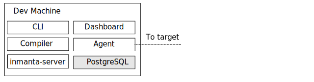
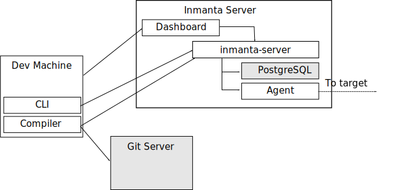
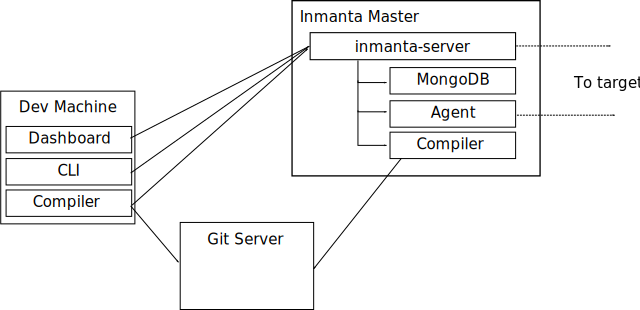

Administration Guide
========================

Deployment models
-------------------

IMS consists of several components: 

.. image:: _static/component.svg
   :width: 90%
   :alt: Overview of the Inmanta platform

* The inmanta server. This server manages the deployment process, it keeps track of all agents and the current state of all projects.
* A mongodb database. The inmanta server stores it state in a mongo database.
* The git server. The source code of the configuration models is stored in (one or more) git repositories.  
* The compiler. The compiler converts the source code into deployable artifacts and exports it to the server.
* CLI and Dashboard. To control the server, you can use either the web dashboard or the command line tools. 
* The Inmanta agents. Agents deploy configuration to the target machines. Agent can run on the server, or on the machines they manage. 

There are three main deployment models:

* embedded: all components are started with the deploy command, the server is terminated after the deploy is finished. Suitable only for development.
* push to server: the server is deployed independently. Models are compiled on the developer machine and pushed to the server directly. Suitable only for small setups.
* autonomous server: the server is deployed independently. Models are stored in git repos and compiled by the server.

Embedded
^^^^^^^^^^

   

In a embedded deployment, all components are started by the compiler and terminated after the deploy is complete. 
No specific setup is required. To deploy the current model, use::

   inmanta deploy
   
   
Push to server
^^^^^^^^^^^^^^^^^^^^

   
In a push to server model, the server is deployed independently, but models are still compiled on the developer machine.
This gives faster feedback to developers, but makes the compilation less reproducible. 
   
   
Autonomous server
^^^^^^^^^^^^^^^^^^^^

With an autonomous server, developers can no longer push models into production directly. Only the server itself can compile the models. This ensures that every compile is repeatable.

Server side agents 
-------------------
The server is capable of running one or more agents. Server side agents are used for

1. agent that talk to API's.  When the agent is not tied to any specific machine, it can be run on the server itself.
2. agentless operation. When installing agents on machines is not possible, agents can remotely manage their target machine via SSH. 

.. todo::  add config details for server side agent and agentless operation

Local Agents
-------------------

To manage machines, the agent can be installed on the machine. The agent will then connect to the to management server and perform all operations for its hosts.

.. todo::  add config details for local agents
