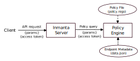

Authorization providers
=======================

The Inmanta server supports two authorization providers: ``policy-engine`` and ``legacy``.

* ``policy-engine``: The policy-engine authorization provider allows fine-grained access control by writing an access policy file.
* ``legacy``: The legacy authorization provider is the old authorization provider that provides limited, coarse-grained access control.

The authorization provider for the Inmanta server can be configured using the :inmanta.config:option:`server.authorization-provider` config option. The details of each provider are discussed in more detail in the following sections.

Policy-engine authorization provider
------------------------------------

The policy-engine authorization provider relies on a policy engine (more concretely the `Open Policy Agent <https://www.openpolicyagent.org/>`_ policy engine) and an access policy to determine whether an API request is authorized or not. The picture below provides a high-level overview on how this provider works:

* When the policy-engine authorization provider is enabled, the Inmanta server starts a policy engine. This engine has access to two sources of information: The access policy defined by the user and the details about the different API endpoints defined on the Inmanta server.
* When an API call arrives on the Inmanta server, a query is sent to the policy engine to determine whether the API call is authorized. It does so by providing the parameters of the API call and the decoded access token to the policy engine. If the policy allows the request, the API call is executed. Otherwise a permission denied is returned to the client.

When this authorization provider is enabled, it's used to evaluate authorization of end-user API calls. Machine-to-machine requests, i.e. requests that have the client type ``compiler`` or ``agent`` in their access token, are always handled using the legacy authorization provider.

Data sources for policy engine
^^^^^^^^^^^^^^^^^^^^^^^^^^^^^^

As mentioned above, the policy engine relies on three pieces of information to determine whether an API call is authorized:

* Authorization-related metadata about each API endpoint on the server
* The data in the specific API request made by the client
* The access policy

The sections below discuss each of these three elements in more detail.

Metadata API endpoints
""""""""""""""""""""""

Every API endpoint on the server is annotated with the following authorization-related metadata:

* **client_types**: The client types for which the API endpoint is intended (api, agent or compiler).
* **auth_label**: API endpoints that manipulate/inspect similar data are grouped together by applying the same label to them. This property indicates the label of the endpoint. The labels can be used to define shorter and better structured access policies.
* **read_only**: A boolean value that indicates whether the API endpoint is read-only or not.
* **environment_param**: The parameter in the API request that contains the ID of the environment on which the API call is executed. Or null, if the API endpoint is environment independent.

All the above-mentioned information is made available in the access policy using the ``data.endpoints`` variable. The snippet below provides an example about what the endpoints dictionary looks like:

.. code-block:: rego

    {
        "endpoints": {
            "GET /api/v1/project/{id}": {
                "client_types": ["api"],
                "auth_label": "project.read",
                "read_only": true,
                "environment_param": "id",
            },
            "POST /lsm/v1/service_inventory/{service_entity}": {
                "client_types": ["api", "agent"],
                "auth_label": "instance.write",
                "read_only": false,
                "environment_param": "X-Inmanta-tid",
            },
            ...
        }
    }

The ``inmanta policy-engine print-endpoint-data`` command prints the full datastructure for all endpoints on the inmanta server.

Data in API request
"""""""""""""""""""

The parameters of the specific API call being processed and the decoded access token are available in the access policy using respectively
the ``input.request`` and ``input.token`` variable. The snippet below provides an example about what this datastructure looks like.

.. code-block:: rego

   {
       "input": {
           "request": {
               "endpoint_id": "PUT /api/v2/environment",
               "parameters": {
                   "branch": "master",
                   "description": "",
                   "environment_id": "c5136bf0-76f9-42db-be6f-ce7a90d587b6",
                   "icon": "",
                   "name": "env",
                   "project_id": "e89f1a3a-7a98-4be2-a23f-3eb01183bef2",
                   "repository": "https://github.com/inmanta/example.git",
               }
           },
           "token": {
               "aud": ["https://localhost:8888/"],
               "iss": "https://localhost:8888/",
               "urn:inmanta:ct": ["api"],
               "urn:inmanta:is_admin": True,
               "urn:inmanta:roles": {},
           }
       }
   }

This information is written at INFO level to the policy-engine.log file for each API request made to the Inmanta server that is evaluated using the policy engine.

Access policy
"""""""""""""

The access policy is written in the `Rego query language <https://www.openpolicyagent.org/docs/policy-language>`_. The policy must contain a rule named ``allow`` that evaluates to a boolean value. This rule is evaluated for each API call. If the rule evaluates to True, the API call is authorized. Otherwise it's not. The snippet below provides a short policy that grants read-only access to users having the ``read-only`` role and any access to users with the ``user`` role.

.. code-block:: rego

    package policy

    # Get the metadata for the specific endpoint that is called.
    endpoint_data := data.endpoints[input.request.endpoint_id]

    # Don't allow anything that is not explicitly allowed.
    default allow := false

    # Give read-only access to users with the read-only role.
    allow if {
        input.token.role == "read-only"
        endpoint_data.read_only == true
    }

    # Users with the user role are allowed to call any API endpoint.
    allow if {
        input.token.role == "user"
    }

.. _authorization-default-access-policy:

Default access policy
^^^^^^^^^^^^^^^^^^^^^

The Inmanta server comes with a default policy that is defined in ``/etc/inmanta/authorization/policy.rego``. The policy assumes that there are two types of roles: environment-scoped roles and global roles. As the same suggests, environment-scoped roles are only relevant within a specific environment. Global roles are relevant on the entire Inmanta server. The default policy defines the following roles:

1. Environment-scoped roles:

   * **read-only**: Users with this role have read-only access on everything in a certain environment.
   * **noc**: Users with this role can do anything in a certain environment, except for modifying the desired state, changing environment settings and expert operations.
   * **operator**: Users with this role can create, update and delete service instances in a certain environment next to all the actions allowed by the noc role.
   * **environment-admin**: Users with this role can do anything in a certain environment, except for expert operations.
   * **environment-expert-admin**: Users with this role can do anything in a certain environment.

2. Global admin role: A user with this role can execute any API endpoint on the Inmanta server.

The default policy makes the following assumptions about the content of the access token. This has to be configured correctly when using a third-party authorization provider:

* The ``sub`` claim is present and contains the username of the user the token is for.
* Environment-scoped roles are defined in the ``urn:inmanta:roles`` claim of the access token. The value must be a dictionary that maps the ID of the environment to a list of roles the user has in that environment.
* Global admins must have the claim ``urn:inmanta:is_admin`` in the access token with the value set to ``true``.

Integration with database authentication
^^^^^^^^^^^^^^^^^^^^^^^^^^^^^^^^^^^^^^^^

The default policy integrates seamlessly with database authentication.

* The admin user created using the ``/opt/inmanta/bin/inmanta-initial-user-setup`` command will have the ``urn:inmanta:is_admin`` claim set to true.
* The web-console provides support to manage users and role assignments.

If the policy contains a ``roles`` variable that contains a list role names, the Inmanta server will create these roles automatically when the server starts. The default policy defines this variable for the roles it can handle. That way there is no need to create roles by hand. The snippet below provides an example. Removing a role from this list will not remove that role when the server starts. That should be done manually.

.. code-block:: rego

    package policy

    # Define roles
    roles := ["read-only", "noc", "operator", "environment-admin", "environment-expert-admin"]

    # Get the metadata for the specific endpoint that is called.
    endpoint_data := data.endpoints[input.request.endpoint_id]

    # Don't allow anything that is not explicitly allowed.
    default allow := false
    ...

Enable the policy-engine authorization provider
^^^^^^^^^^^^^^^^^^^^^^^^^^^^^^^^^^^^^^^^^^^^^^^

1. Set the :inmanta.config:option:`server.authorization-provider` config option to ``policy-engine``.
2. Modify the default policy at ``/etc/inmanta/authorization/policy.rego`` if desired. More information about writing your own access policy is available :ref:`here<authorization-writing-own-policy>`.
3. If a 3rd party auth broker is used, it must be configured to correctly set all claims required by the access policy. See :ref:`here<authorization-default-access-policy>` for claims required by the default policy.
4. Restart the inmanta server to activate the configuration changes.

.. _authorization-writing-own-policy:

Writing a custom access policy
^^^^^^^^^^^^^^^^^^^^^^^^^^^^^^

This section provides some guidance on how to test/debug your own access policy.

Troubleshooting: Policy engine fails to start
"""""""""""""""""""""""""""""""""""""""""""""

When the access policy contains a syntax error, the policy engine will fail to start and as such also the Inmanta server. In that case, the ``server.log`` file will indicate that the policy engine failed to start with a reference to the log file of the policy engine. The latter log file will contain more information about the specific issue. If required, the log level of the policy engine can be increased using the :inmanta.config:option:`policy_engine.log-level` config option.

.. _authorization-debugging-access-policy:

Debugging an access policy
""""""""""""""""""""""""""

If the access policy doesn't behave as expected, it can be debugged using the `Open Policy Agent extension for VS Code <https://www.openpolicyagent.org/docs/debugging#live-debugging>`_. Make sure the project contains the following three files:

* The policy file: This file needs to be in a directory (package) called *policy*.
* The data for the policy: This information can be obtained using the ``inmanta policy-engine print-endpoint-data`` command. Put the output in a file called *data.json*.
* The input for the policy: This information is logged at INFO level in the policy engine log file ``<log-dir>/policy_engine.log`` when a policy evaluation request is made by the server. If required, increase the log level of the policy engine using the :inmanta.config:option:`policy_engine.log-level` config option. For the specific API request that needs to be debugged, search for the ``received request`` log line in the policy engine log file as mentioned in the snippet below. Put the content of ``req_body`` in a file named *input.json*.

.. code-block:: rego

    [INFO] Received request.
      req_path = "/v1/data/policy/allow"
      req_body = |
          {
            "input": {
              "request": {
                "endpoint_id": "GET /api/v2/project",
                "parameters": {
                  "environment_details": false
                }
              },
              "token": {
                "iss": "https://77a5e8f227e8:8888/",
                "aud": [
                  "https://77a5e8f227e8:8888/"
                ],
                "urn:inmanta:ct": [
                  "api"
                ],
                "sub": "admin",
                "urn:inmanta:roles": {},
                "urn:inmanta:is_admin": true
              }
            }
          }
      req_params = {}
      client_addr = "@"
      req_id = 7
      req_method = "POST"

Now, open the policy file in VS Code and click on the debug button above the allow rule to start the debugger. The built-in ``print`` function can also be used to evaluate sub-expressions.

Testing an access policy
""""""""""""""""""""""""

Open Policy Agent provides support to write test cases for an access policy. To do this create a Rego project containing the access policy and data.json file as mentioned in the :ref:`previous section<authorization-debugging-access-policy>`. More information on how to write test cases and how to run them can be found `here <https://www.openpolicyagent.org/docs/policy-testing>`_.

Legacy authorization provider
-----------------------------

The legacy provider provides limited support for authorization by checking for inmanta specific claims inside the token. All inmanta claims
are prefixed with ``urn:inmanta:``. These claims are:

* ``urn:inmanta:ct`` A *required* comma delimited list of client types for which this client is authenticated. Each API call
  has one or more allowed client types. The list of valid client types (ct) are:

  * agent
  * compiler
  * api (cli, web-console, 3rd party service)
* ``urn:inmanta:env`` An *optional* claim. When this claim is present, the token is scoped to this inmanta environment. All
  tokens that the server generates for agents and compilers have this claim present to limit their access to the environment
  they belong to.

