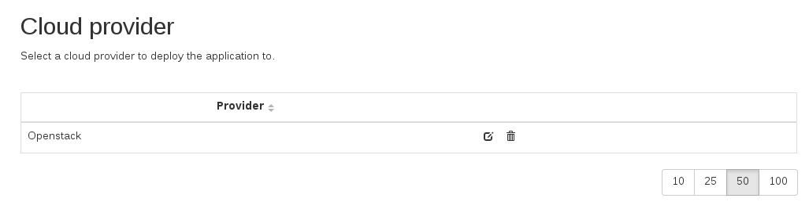

Forms
=====

Inmanta is capable of generating forms for the dashboard automatically. This makes customizing models a lot easier for end-users (and it creates a rest interface for your model).

In this example, we show how to make a form to choose OpenStack or Amazon and collect the credentials.

For example:

`Full source here <https://github.com/inmanta/inmanta/tree/master/docs/examples/forms>`_

Defining Forms
---------------------------

Forms always have to be in a module. So, in the module formtest, we define our forms.

To define a form, just create an entity that extends *param::Form*

.. literalinclude:: ../examples/forms/libs/formtest/model/_init.cf
   :language: ruby

Special fields and conventions:

 * Each field in the entity becomes a field in the form.
 * Fields with an _ in the name can be used to pass metadata to the forms api.

+--------------------+------------------------------------------------------------------------------------------------------------+
| _title             | the title of the form                                                                                      |
+--------------------+------------------------------------------------------------------------------------------------------------+
| _help              | help text of the form                                                                                      |
+--------------------+------------------------------------------------------------------------------------------------------------+
| _record_count      | if you set this value to 1, the form can be filled in only once, otherwise multiple records can be created |
+--------------------+------------------------------------------------------------------------------------------------------------+
| fieldname__widget  | what widget to use in the form, options are 'options','checkbox','slider'. Omit for textbox.               |
+--------------------+------------------------------------------------------------------------------------------------------------+
| fieldname__options | comma separated list of options, for use with option widget                                                |
+--------------------+------------------------------------------------------------------------------------------------------------+
| fieldname__min     | lowest value for numerical values                                                                          |
+--------------------+------------------------------------------------------------------------------------------------------------+
| fieldname__max     | highest value for numerical values                                                                         |
+--------------------+------------------------------------------------------------------------------------------------------------+
| fieldname__help    | help text for the field                                                                                    |
+--------------------+------------------------------------------------------------------------------------------------------------+

Using Forms
---------------------------

To access a form with only one record, use `param::one`. Note that you don't get an instance of the form object back, but that you have to get the information out, one field at a time.

To access a form with multiple records, use `param::instances` to get a list of instances. Then use `param::get` to get the fields of the instances.

.. literalinclude:: ../examples/forms/main.cf
   :language: ruby

When you compile a model with a form, on first compile, the form definitions are sent to the server.
All calls to `param::one` and `param::instances` return 'Unknown' which means that parts of the model that use these values are dropped from the output.

.. note::

    When compiling models with forms, the compiler must always be able to connect to a server, or compilation will fail.

In the dashboard, you will now see the forms you have defined. If you fill in values and recompile, the values are used in the model.

Using the CLI
---------------------------

Forms can also be accessed via the CLI

There are two main endpoint: forms and records.
Forms gives you access to all form definitions per environment, records gives you access to all record for each form.

For example:

.. code-block:: bash

    $> inmanta-cli form list -e b6a0357f-8936-4db5-91f9-2c5ca75bf134
    +-------------------------+--------------------------------------+
    | Form Type               | Form ID                              |
    +-------------------------+--------------------------------------+
    | formtest::CloudProvider | 78616841-d757-4112-ac79-033373c72ff4 |
    | formtest::User          | e1f21a14-5e21-4c6d-82b8-2303f3a7ce60 |
    +-------------------------+--------------------------------------+
    $> inmanta-cli form show  -e b6a0357f-8936-4db5-91f9-2c5ca75bf134 -t formtest::User
    +-------+---------------------------------------+
    | Field | Value                                 |
    +-------+---------------------------------------+
    | name  | type: string                          |
    | admin | type: bool, default: {'admin': False} |
    +-------+---------------------------------------+
    $> inmanta-cli record list -e b6a0357f-8936-4db5-91f9-2c5ca75bf134 -t formtest::User
    +--------------------------------------+----------------------------+
    | Record ID                            | Changed                    |
    +--------------------------------------+----------------------------+
    | 38d2a543-89c3-4e90-9602-d827f9d1e6cb | 2016-11-08T16:20:11.229000 |
    | 64211c57-1874-4445-8ede-c2dfa3be3bd4 | 2016-11-08T16:20:17.047000 |
    +--------------------------------------+----------------------------+
    $> inmanta-cli record list -e b6a0357f-8936-4db5-91f9-2c5ca75bf134 -t formtest::User -a
    +--------------------------------------+----------------------------+-------+-----------+
    | Record ID                            | Changed                    | admin | name      |
    +--------------------------------------+----------------------------+-------+-----------+
    | 38d2a543-89c3-4e90-9602-d827f9d1e6cb | 2016-11-08T16:20:11.229000 | True  | adminuser |
    | 64211c57-1874-4445-8ede-c2dfa3be3bd4 | 2016-11-08T16:20:17.047000 | False | testuser  |
    +--------------------------------------+----------------------------+-------+-----------+

To create records

.. code-block:: bash

    $> inmanta-cli record create -e b6a0357f-8936-4db5-91f9-2c5ca75bf134 -t formtest::User -p admin=False -p name=TestCLi
    +-------+---------+
    | Field | Value   |
    +-------+---------+
    | admin | False   |
    | name  | TestCLi |
    +-------+---------+
    $> inmanta-cli record list -e b6a0357f-8936-4db5-91f9-2c5ca75bf134 -t formtest::User -a
    +--------------------------------------+----------------------------+-------+-----------+
    | Record ID                            | Changed                    | admin | name      |
    +--------------------------------------+----------------------------+-------+-----------+
    | 38d2a543-89c3-4e90-9602-d827f9d1e6cb | 2016-11-08T16:20:11.229000 | True  | adminuser |
    | 64211c57-1874-4445-8ede-c2dfa3be3bd4 | 2016-11-08T16:20:17.047000 | False | testuser  |
    | c954706f-c13d-40e1-8daf-e596b54e6567 | 2016-11-08T16:32:13.614000 | False | TestCLi   |
    +--------------------------------------+----------------------------+-------+-----------+

Using the API
---------------------------

Forms can also be access via the API. This is similar to the CLI, but easier to use in scripts.
Examples use `httpie <https://httpie.org/>`_

Important is that the environment is passed as a header called *X-Inmanta-tid*

The same as above, but via http:

.. code-block:: bash

    $> http GET 127.0.0.1:8888/form X-Inmanta-tid:b6a0357f-8936-4db5-91f9-2c5ca75bf134
    {
        "forms": [
            {
                "form_id": "78616841-d757-4112-ac79-033373c72ff4",
                "form_type": "formtest::CloudProvider"
            },
            {
                "form_id": "e1f21a14-5e21-4c6d-82b8-2303f3a7ce60",
                "form_type": "formtest::User"
            }
        ]
    }

    $> http GET 127.0.0.1:8888/form/formtest::CloudProvider X-Inmanta-tid:b6a0357f-8936-4db5-91f9-2c5ca75bf134
    {
        "form": {
            "defaults": {},
            "field_options": {
                "provider": {
                    "options": "AWS,Openstack",
                    "widget": "options"
                }
            },
            "fields": {
                "provider": "string"
            },
            "form_id": "78616841-d757-4112-ac79-033373c72ff4",
            "form_type": "formtest::CloudProvider",
            "options": {
                "help": "Select a cloud provider to deploy the application to.",
                "record_count": 1,
                "title": "Cloud provider"
            }
        }
    }
    $> http GET 127.0.0.1:8888/records form_type=formtest::User  X-Inmanta-tid:b6a0357f-8936-4db5-91f9-2c5ca75bf134
    {
        "records": [
            {
                "changed": "2016-11-08T16:20:11.229000",
                "record_id": "38d2a543-89c3-4e90-9602-d827f9d1e6cb"
            },
            {
                "changed": "2016-11-08T16:20:17.047000",
                "record_id": "64211c57-1874-4445-8ede-c2dfa3be3bd4"
            },
            {
                "changed": "2016-11-08T16:32:13.614000",
                "record_id": "c954706f-c13d-40e1-8daf-e596b54e6567"
            }
        ]
    }
    $> http GET 127.0.0.1:8888/records form_type=formtest::User include_record=True  X-Inmanta-tid:b6a0357f-8936-4db5-91f9-2c5ca75bf134
    {
        "records": [
            {
                "changed": "2016-11-08T16:20:11.229000",
                "fields": {
                    "admin": true,
                    "name": "adminuser"
                },
                "form_id": "e1f21a14-5e21-4c6d-82b8-2303f3a7ce60",
                "form_type": "formtest::User",
                "record_id": "38d2a543-89c3-4e90-9602-d827f9d1e6cb"
            },
            {
                "changed": "2016-11-08T16:20:17.047000",
                "fields": {
                    "admin": false,
                    "name": "testuser"
                },
                "form_id": "e1f21a14-5e21-4c6d-82b8-2303f3a7ce60",
                "form_type": "formtest::User",
                "record_id": "64211c57-1874-4445-8ede-c2dfa3be3bd4"
            },
            {
                "changed": "2016-11-08T16:32:13.614000",
                "fields": {
                    "admin": false,
                    "name": "TestCLi"
                },
                "form_id": "e1f21a14-5e21-4c6d-82b8-2303f3a7ce60",
                "form_type": "formtest::User",
                "record_id": "c954706f-c13d-40e1-8daf-e596b54e6567"
            }
        ]
    }

To create records:

.. code-block:: bash

    $> http POST 127.0.0.1:8888/records form_type=formtest::User X-Inmanta-tid:b6a0357f-8936-4db5-91f9-2c5ca75bf134 form:='{"name":"apitest","admin":false}'
    {
        "record": {
            "changed": "2016-11-08T16:49:50.239000",
            "fields": {
                "admin": false,
                "name": "apitest"
            },
            "form_id": "e1f21a14-5e21-4c6d-82b8-2303f3a7ce60",
            "form_type": "formtest::User",
            "record_id": "d652db64-77b7-477b-b4f6-e222883f4a47"
        }
    }

    $> http GET 127.0.0.1:8888/records form_type=formtest::User include_record=True  X-Inmanta-tid:b6a0357f-8936-4db5-91f9-2c5ca75bf134
    {
        "records": [
            {
                "changed": "2016-11-08T16:20:11.229000",
                "fields": {
                    "admin": true,
                    "name": "adminuser"
                },
                "form_id": "e1f21a14-5e21-4c6d-82b8-2303f3a7ce60",
                "form_type": "formtest::User",
                "record_id": "38d2a543-89c3-4e90-9602-d827f9d1e6cb"
            },
            {
                "changed": "2016-11-08T16:20:17.047000",
                "fields": {
                    "admin": false,
                    "name": "testuser"
                },
                "form_id": "e1f21a14-5e21-4c6d-82b8-2303f3a7ce60",
                "form_type": "formtest::User",
                "record_id": "64211c57-1874-4445-8ede-c2dfa3be3bd4"
            },
            {
                "changed": "2016-11-08T16:32:13.614000",
                "fields": {
                    "admin": false,
                    "name": "TestCLi"
                },
                "form_id": "e1f21a14-5e21-4c6d-82b8-2303f3a7ce60",
                "form_type": "formtest::User",
                "record_id": "c954706f-c13d-40e1-8daf-e596b54e6567"
            },
            {
                "changed": "2016-11-08T16:49:50.239000",
                "fields": {
                    "admin": false,
                    "name": "apitest"
                },
                "form_id": "e1f21a14-5e21-4c6d-82b8-2303f3a7ce60",
                "form_type": "formtest::User",
                "record_id": "d652db64-77b7-477b-b4f6-e222883f4a47"
            }
        ]
    }
