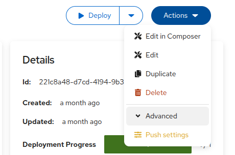
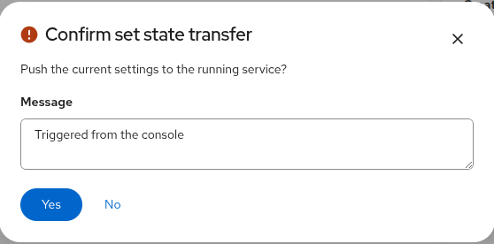
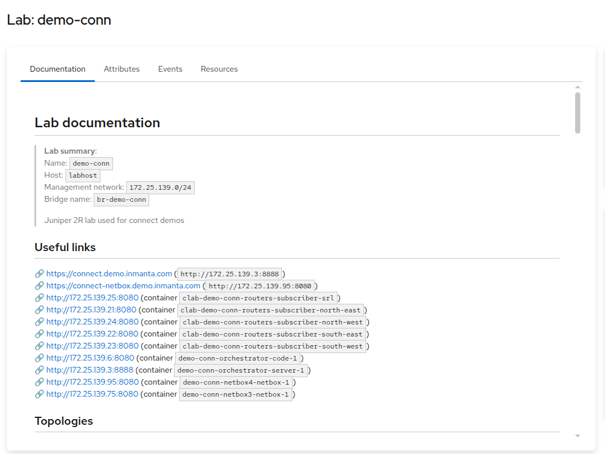
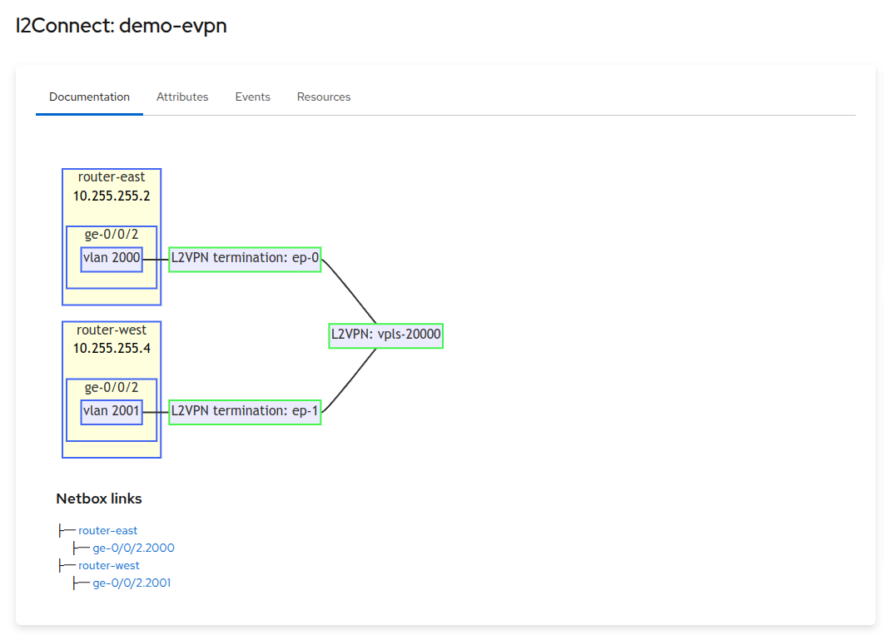
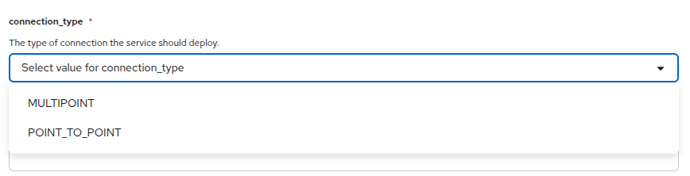
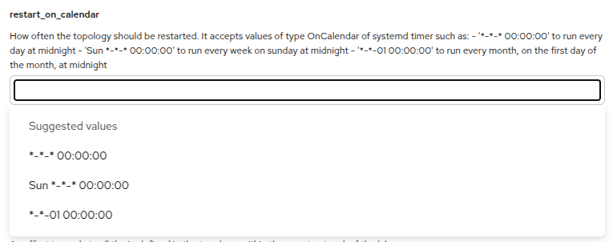
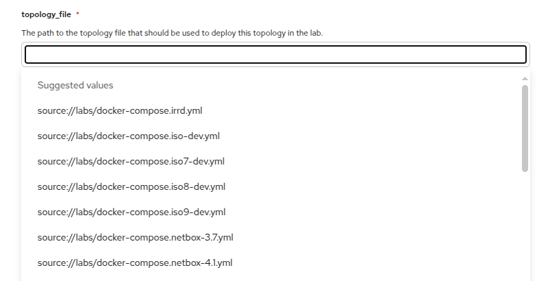
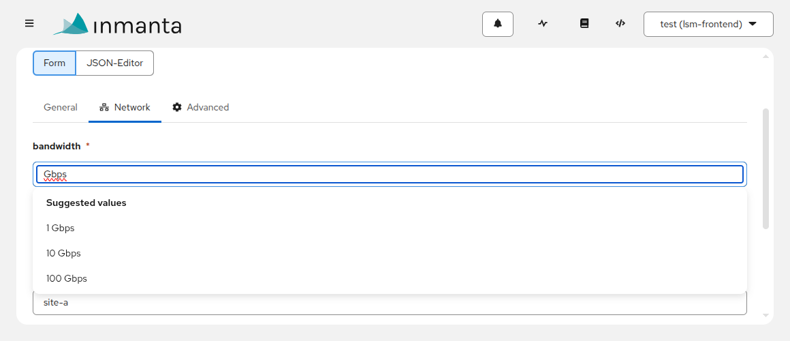
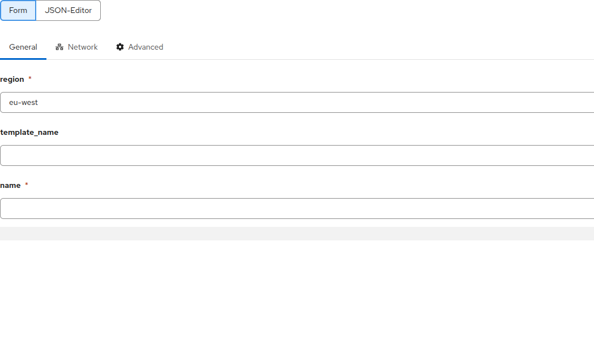

# Attribute and entity metadata


This section describes the metadata fields that can be associated with service entities, embedded entities and its attributes
and how these metadata fields can be set in the model.


## Attribute description

The attribute description metadata is useful to provide textual information about attributes. This text will be displayed in the
service catalog view of the web console.

To add a description to an attribute, create a docstring that documents the attribute. The compiler will pick this up and register
it as the description of that attribute.

For example:

```inmanta
entity Interface:
    """ A network interface

        :attr interface_name: The name of the interface
    """
    string interface_name
end
```

A detailed example can be found {ref}`here <quickstart_orchestration_model>`.

(attributes_metadata_attribute_modifiers)=
## Attribute modifier

Adding the attribute modifier metadata lets the compiler know if:

* This attribute should be provided by an end-user or set by the orchestrator.
* This attribute's value is allowed to change after creation.

The modifier itself is defined like a regular attribute, with a few caveats:

* it should be of type lsm::attribute_modifier.
* its name should extend the decorated attribute's name with the suffix `__modifier`.
* its value should be one of the supported values:

  * **r**: This attribute can only be set by an allocator.
  * **rw**: This attribute can be set on service instantiation. It cannot be altered anymore afterwards.
  * **rw+**: This attribute can be set freely during any phase of the lifecycle.


Attributes modifiers can also be specified on {ref}`relational attributes <attribute_modifiers_on_a_relationship>`.


For example:

```inmanta
entity Interface :
    string interface_name
    lsm::attribute_modifier interface_name__modifier="rw+"
end
```

A detailed example can be found {ref}`here <quickstart_orchestration_model>`.

## Annotations

Annotations are key-value pairs that can be associated with an entity (service entity or embedded entity) or an attribute
(simple attribute or relational attribute). These annotations don't influence the behavior of LSM or the Inmanta Service
Orchestrator itself, but are intended to pass meta data to other components. For example, they can be used to pass on
visualization meta-data to the the web-console to improve the user-experience.

Two key prefixes are reserved: `web_*` for the web console and `inmanta_*` for the orchestrator itself. Any other key is free
to use for model authors and for integrations that read the service catalog.

### Annotations on entities

Annotations can be attached to an entity using the `__annotations` attribute. This attribute has the type `dict` and requires a
default value that defines the annotations. Each key-value pair in the dictionary contains respectively the name and the value
of the annotation. The value of an annotation can be any of the simple types (string, float, int, bool), lists and dicts. Note:
These values are the default values of an attribute, therefore they must be constants and cannot include variables, attribute
access or plugins.

The example below illustrates how the annotation `annotation=value` can be set on on a service entity. Annotations can be set on
embedded entities in the same way.

```inmanta
entity Interface extends lsm::ServiceEntity:
    string interface_name
    dict __annotations = {"annotation": "value"}
end
```

### Annotations on simple attributes

Annotations can be attached to simple (non-relational) attributes by defining an attribute of type dict, with a name
`<attribute>__annotations`, where `<attribute>` is the name of the attribute the annotations belong to. This attribute needs a
default value containing the attributes. The values of the elements in the dictionary must be strings.

The example below shows how the annotation `annotation=value` is set on the attribute `interface_name`. Annotations can be set
on simple attributes of embedded entities in the same way.

```inmanta
entity Interface extends lsm::ServiceEntity:
    string interface_name
    dict interface_name__annotations = {"annotation": "value"}
end
```

### Annotations on relational attributes

Annotations can be attached to a relational attribute by replacing the `--` part of the relationship definition with an instance
of the `lsm::RelationAnnotations` entity. This entity has a dict attribute `annotations` that represents the annotations that
should be set on the relational attribute. The values of this dictionary must be strings. By convention the name of the
`lsm::RelationAnnotations` instance should be prefixed and suffixed with two underscores. This improves the readability of the
relationship definition.

The example below illustrates how the annotation `annotation=value` can be attached to the relational attribute `ports`.

```inmanta
entity Router extends lsm::ServiceEntity:
    string name
end

entity Port extends lsm::EmbeddedEntity:
    number id
end

__annotations__ = lsm::RelationAnnotations(
    annotations={"annotation": "value"}
)
Router.ports [0:] __annotations__ Port._router [1]
```

### Annotations on lifecycle states and transfers

The states and transfers of a lifecycle can carry annotations as well. They are set with the `__annotations` attribute on the
`lsm::State` and `lsm::StateTransfer` instances that make up the lifecycle. This requires version 4.1.0 or later of the `lsm`
module.

Unlike entity and attribute annotations, these are read from the constructed instance instead of from a default value on the
entity definition. Their values therefore do not have to be constants: anything that evaluates to a `dict` at compile time can
be used, including variables and plugin calls.

The keys recognized by the web console are listed below. The orchestrator does not validate them: a key it does not know is
stored and returned unchanged, and the web console ignores it.

#### State presentation

| Annotation        | Effect                                                                                             |
| ----------------- | -------------------------------------------------------------------------------------------------- |
| `web_label`       | Text shown for the state, instead of the raw state name.                                           |
| `web_icon`        | [Font awesome icon](https://react-icons.github.io/react-icons/icons/fa/) shown on the state badge. |
| `web_description` | Text shown in a tooltip when the state badge is hovered.                                           |

These apply wherever the web console shows a lifecycle state: the *State* column of the service inventory, the state history of
a service instance and the lifecycle table of the service entity in the service catalog.

For example, this state is shown as a badge labelled *Up*, with a check-circle icon, and explains itself on hover:

```inmanta
up = lsm::State(
    name="up",
    label="success",
    export_resources=true,
    __annotations={
        "web_label": "Up",
        "web_icon": "FaCheckCircle",
        "web_description": "The service is deployed and operational.",
    },
)
```

The text and the icon of the badge come from the annotations. Its colour keeps coming from the `label` attribute of the state,
which is unrelated to `web_label`.

#### Transfer presentation

An `api_set_state` transfer out of the current state of an instance is offered as an entry in the *Actions* menu of that
instance, both in the inventory and on the instance details page. These annotations control how that entry looks and behaves:

| Annotation           | Effect                                                                                         |
| -------------------- | ---------------------------------------------------------------------------------------------- |
| `web_button_label`   | Text of the menu entry.                                                                        |
| `web_icon`           | [Font awesome icon](https://react-icons.github.io/react-icons/icons/fa/) on that entry.        |
| `web_button_variant` | `danger` or `warning`: colours the entry to signal how disruptive the transfer is.             |
| `web_advanced_state` | When `true`, moves the entry into an *Advanced* section that is collapsed by default.          |
| `web_confirm`        | Text of the confirmation prompt shown before the transfer is executed.                         |
| `web_button_type`    | `primary`, `secondary`, `tertiary` or `link`: emphasis of the button in the documentation tab. |

For example, this transfer out of the `up` state above:

```inmanta
setting_start = lsm::State(name="setting_start", export_resources=true, validate_self="candidate")

push_settings = lsm::StateTransfer(
    description="up to setting_start",
    source=up,
    target=setting_start,
    api_set_state=true,
    error=null,
    __annotations={
        "web_button_label": "Push settings",
        "web_icon": "FaSlidersH",
        "web_button_type": "secondary",
        "web_button_variant": "warning",
        "web_confirm": "Push the current settings to the running service?",
        "web_advanced_state": true,
    },
)
```

`web_advanced_state` keeps the entry out of the main list, `web_button_label` names it, `web_icon` gives it the sliders icon
and `web_button_variant` colours it:



and `web_confirm` supplies the prompt that is shown when it is selected:



A few things to keep in mind:

- When `web_button_label` is not set, the `web_label` of the target state is used as the label of the menu entry, and
  otherwise the name of the target state.
- `web_confirm` replaces the text of the default confirmation prompt. It does not add or remove the message field that the
  set-state prompt already has.
- `web_button_type` has no effect on the menu entry itself, only on the documentation tab button described below. All entries
  of the *Actions* menu are rendered the same way.
- The other annotations only have an effect on transfers with `api_set_state` set to `true`, because those are the only ones
  an operator invokes by name. The one exception is `web_confirm` on the transfer with `on_delete` set to `true`: that is the
  prompt of the delete confirmation for an instance in that state. On a transfer with `on_update` it currently has no effect,
  because updating an instance opens the edit form instead of a confirmation dialog.
- `web_advanced_state` is a presentation hint, not a permission: the transfer stays available through the API and remains one
  click away in the web console. It is meant to declutter the menu of a state with many transfers, not to protect an operation.

#### setState buttons in the documentation tab

A [documentation tab](#documentation-tabs) can contain buttons that request a state transfer for the instance it documents.
Such a button is written as a `setState` code block that holds a JSON object:

````markdown
```setState
{"targetState": "setting_start"}
```
````

The only required field is `targetState`. The other fields are optional: `displayText`, `type`, `variant` and `icon` control
how the button looks, `isInline` renders it as part of the surrounding text and `isSmall` renders it in a smaller size. When
one of the first four is not set in the code block, its value is taken from the annotations of the transfer that goes from the
current state of the instance to `targetState`:

| Field         | Taken from                                                 | Used when neither is set     |
| ------------- | ---------------------------------------------------------- | ---------------------------- |
| `displayText` | `web_button_label`, or the `web_label` of the target state | the name of the target state |
| `type`        | `web_button_type`                                          | `primary`                    |
| `variant`     | `web_button_variant`                                       | no status colour             |
| `icon`        | `web_icon`                                                 | no icon                      |

A button configured this way stays overridable per document: a field that is present in the code block always wins over the
annotation. For the `push_settings` transfer above, a bare `{"targetState": "setting_start"}` block already yields a secondary
warning button labelled *Push settings* with the sliders icon, from `web_button_type`, `web_button_variant`,
`web_button_label` and `web_icon`. The button also shows the `web_confirm` prompt of that transfer, and is disabled while an
older version of the instance is shown, because it performs an action on the current instance.

### Documentation tabs

Annotations can be used to have the web console render the content of one or more attributes in a tab called *Documentation*.
This can be used to document and explain details of the service to the user based on information in the orchestration model. The
attribute value is set during a compile. For example, the following LSM service orchestrates container based labs and provides
an overview of all the different services and devices in the lab.



One or more attributes at the root level can be used and they are all rendered in the documentation tab. In the example the
documentation is defined as follows:

```inmanta
entity Service extends lsm::ServiceBase:
    string documentation = "# Lab documentation"
    lsm::attribute_modifier documentation__modifier = "r"
    dict documentation__annotations = {
        "web_presentation": "documentation",
        "web_title": "Lab overview",
        "web_icon": "FaInfo",
    }
end
```

1. An attribute of type string needs to be defined. We recommend to give it a default value so that the tab is not empty when
   the documentation has not yet been generated by the compiler.
2. The attribute modifier must be `r` which means that it is not defined by the user and only by the orchestrator.
3. Annotations are used to control how the attribute is rendered in the web console:
   - `web_presentation` is set to `documentation`
   - Optionally `web_title` is set to the title that is shown in the tab. This title is only used when multiple attributes are
     defined as documentation. This title will be used on the card that contains the content of this attribute.
   - Optionally `web_icon` specifies a [font awesome icon](https://react-icons.github.io/react-icons/icons/fa/) name (the second
     part without `fa `, for example `FaTv`).  This icon is also only used when multiple attributes are defined as
     documentation.

In the orchestration model a call to `lsm::update_read_only_attribute` is used to upload the content of the documentation tab.
For example:

```inmanta
instance.documentation = lsm::update_read_only_attribute(
    instance,
    "documentation",
    value=std::template(
        "./documentation.md.j2",
        instance=instance,
    ),
)
```

The content of the attribute should be valid markdown. It also supports mermaid diagrams inside the markdown. For example the
following documentation tab is generated in a template:

```markdown
```mermaid
    flowchart LR
    %%{init:{'flowchart':{'nodeSpacing': 20, 'rankSpacing': 10, 'padding': 5}}}%%
    classDef infra stroke:#4266f5, stroke-width:2px
    classDef service stroke:#42f54b, stroke-width:2px

    classDef attribute stroke:#ffffde, fill:#ffffde, color:#000
    router-east:::infra
subgraph router-east
router-east-ip:::attribute
router-east-ip[10.255.255.2]
router-east-ge-0/0/2:::infra
subgraph router-east-ge-0/0/2[ge-0/0/2]
router-east-ge-0/0/2-vlan2000:::infra
router-east-ge-0/0/2-vlan2000[vlan 2000]
end
end
router-west:::infra
subgraph router-west
router-west-ip:::attribute
router-west-ip[10.255.255.4]
router-west-ge-0/0/2:::infra
subgraph router-west-ge-0/0/2[ge-0/0/2]
router-west-ge-0/0/2-vlan2001:::infra
router-west-ge-0/0/2-vlan2001[vlan 2001]
end
end
l2connect:::service
l2-2000:::service
l2-2000[L2VPN termination: ep-0] --- l2connect[L2VPN: vpls-20000]
router-east-ge-0/0/2-vlan2000 --- l2-2000
l2-2001:::service
l2-2001[L2VPN termination: ep-1] --- l2connect[L2VPN: vpls-20000]
router-west-ge-0/0/2-vlan2001 --- l2-2001

\```

### Netbox links
├─ [router-east](http://172.25.139.95:8080/dcim/devices/?q=router-east)
&emsp; ├─ [ge-0/0/2.2000](http://172.25.139.95:8080/dcim/interfaces/?q=ge-0/0/2.2000&device=router-east)
├─ [router-west](http://172.25.139.95:8080/dcim/devices/?q=router-west)
&emsp; ├─ [ge-0/0/2.2001](http://172.25.139.95:8080/dcim/interfaces/?q=ge-0/0/2.2001&device=router-west)

```

And results in the following view:




### Suggested values

The Inmanta Service Orchestrator is API first: our web console uses the same APIs that anyone else can use to integrate.
However, for certain use case the forms generated by the web console on the LSM API provide the UI for the end user of the
automated service. In those cases it can be useful to have more control over the forms that are generated.

A field that has an enum type will be presented in the web console as a select control with a fixed number of options. For
example, an attribute of this type:

```inmanta
typedef connection_type as string matching self in ["POINT_TO_POINT", "MULTIPOINT"]
```

Results in a form control like this:



In cases where you only want to suggest values and allow other values that are not suggested: suggested values can be used. It
exists in two flavors.

The first flavor uses a static list defined in the model. The following example adds a number of suggestions to a field that
accepts a cron like expression. These are non trivial to write and having a number of command suggestions assists the user. It
also still allows for a constrained string type with custom validation:

```inmanta
entity Service extends lsm::ServiceBase:
    cron_type? restart_on_calendar = null
    lsm::attribute_modifier restart_on_calendar__modifier = "rw+"

    dict restart_on_calendar__annotations = {
      "web_suggested_values": {
        "type": "literal",
        "values": ["*-*-* 00:00:00", "Sun *-*-* 00:00:00", "*-*-01 00:00:00"],
      },
    }
end
```

This results in a form control like this, that also provide search and autocompletion:



The annotation that controls this is `web_suggested_values` which as a value also needs a dict with two fields:
- `type` which has to be `literal`
- `values` which is a list of values that the web console should suggest to the user. Each entry is a
  string, or a `{"label": ..., "value": ...}` object when the displayed label should differ from the
  submitted value (see [Separate label and value](#separate-label-and-value)).

Because they are defined as a default value in the model, you can only provide literal strings here. It is not possible to
generate the list using a plugin. The second flavor offers dynamic suggested values based on a parameter in the orchestrator API.

It is possible to have the web console load the list of values from a parameter registered in the orchestrator. These parameters
can then be populated by the compiler or any other external system that has access to the orchestrator. The following example is
taken from a service that supports a number of topology files that are part of a folder in an inmanta module. When the
orchestrator compiles the model, it updates the list based on what is available in the module. This is defined as follows:

```inmanta
entity Service extends lsm::ServiceBase:
    string topology_file
    lsm::attribute_modifier topology_file__modifier = "rw+"
    dict topology_file__annotations = {
        "web_suggested_values": {
            "type": "parameters",
            "parameter_name": "topology_files",
        },
    }
```

This results in a form control like this, which also provides search and autocompletion:



The suggested values are uploaded by adding the following code to the compiler:

```inmanta
import lsm

# Set the suggested values for the topology files
lsm::set_suggested_values(
    "topology_files",
    custom_module::all_matching_files("docker-compose.*.yml"),
)
```

The annotation that is required is also `web_suggested_values` which is also a dict that requires two fields:
- `type` which has to be `parameters`
- `parameter_name` which points to the parameter name in our parameter API endpoint.

The values are expected by the frontend in the `metadata` field of the parameter under the `values` key. For the example above
the API returns the following structure:

```json
[
    {
        "id": "1b0b1d37-abef-4e5f-8100-84ebf4c65f93",
        "name": "topology_files",
        "value": "metadata",
        "environment": "f81be80b-8582-499f-b002-7cdd2f2df98a",
        "source": "user",
        "updated": "2025-03-14T13:23:11.475925+00:00",
        "metadata": {
            "values": [
                "source://labs/docker-compose.irrd.yml",
                "source://labs/docker-compose.iso-dev.yml",
                "source://labs/docker-compose.iso7-dev.yml",
                "source://labs/docker-compose.iso8-dev.yml",
                "source://labs/docker-compose.iso9-dev.yml",
                "source://labs/docker-compose.netbox-3.7.yml",
                "source://labs/docker-compose.netbox-4.1.yml",
            ]
        }
    }
]
```

The `lsm::set_suggested_values` plugin takes care for wrapping the values and setting the value correctly.

#### Separate label and value

By default each suggested value is a single string that is both shown to the user and submitted as the
attribute value. When the value the model needs is not what a human wants to read (a UUID, an id, a
`source://` URI, an internal code), an entry can instead be an object with a `label` and a `value`: the web
console shows and searches on `label`, and submits `value`.

This works for both flavors, and a plain string entry is shorthand for an entry whose label equals its
value, so existing suggestions keep working unchanged.

For the `literal` flavor the objects are placed directly in `values`:

```inmanta
entity Service extends lsm::ServiceBase:
    string bandwidth
    lsm::attribute_modifier bandwidth__modifier = "rw+"
    dict bandwidth__annotations = {
        "web_suggested_values": {
            "type": "literal",
            "values": [
                {"label": "1 Gbps", "value": "1000"},
                {"label": "10 Gbps", "value": "10000"},
            ],
        },
    }
end
```

This results in a control that shows the labels while submitting the underlying values:



For the `parameters` flavor the same object form is allowed in the parameter's `metadata.values` list.
`lsm::set_suggested_values` accepts either plain strings or `{"label": ..., "value": ...}` dicts and stores
them unchanged:

```inmanta
lsm::set_suggested_values(
    "bandwidths",
    [{"label": "1 Gbps", "value": "1000"}, {"label": "10 Gbps", "value": "10000"}],
)
```

#### Variables in the parameter name

For the `parameters` flavor, the `parameter_name` may contain placeholders that the web console substitutes
from the context of the form it is rendering. This lets a single annotation point at a per-entity or
per-instance parameter instead of one shared parameter for the whole environment.

| Variable                   | Substituted with                                                             |
| -------------------------- | ---------------------------------------------------------------------------- |
| `${entity_type}`           | The name of the service entity, as used in the service catalog and API paths.|
| `${identifying_attribute}` | The current value of the service's identifying attribute.                    |
| `${instance_id}`           | The id of the instance being edited (empty while creating a new instance).   |

```inmanta
entity Service extends lsm::ServiceBase:
    string topology_file
    lsm::attribute_modifier topology_file__modifier = "rw+"
    dict topology_file__annotations = {
        "web_suggested_values": {
            "type": "parameters",
            "parameter_name": "topology_files_${entity_type}",
        },
    }
end
```

The compiler (or any external system) then publishes the values under the resolved name. For a service
registered as `my-service` the example above reads the parameter `topology_files_my-service`:

```inmanta
lsm::set_suggested_values(
    "topology_files_my-service",
    custom_module::all_matching_files("docker-compose.*.yml"),
)
```

A few things to keep in mind:

- A variable that has no value yet (for example `${instance_id}` on a creation form) results in no
  suggestions until it has a value, rather than fetching an incomplete parameter name.
- Because `${identifying_attribute}` reflects a value the user is still typing, the web console waits for
  the input to settle and then re-queries.
- A placeholder that is not one of the variables above is reported as an error on the field.

### Form tabs

Large service forms can be split into tabs so that the create and edit forms stay navigable. This is
controlled by two annotations: a catalog of tabs on the entity, and a per-field assignment to a tab.

The catalog is a `web_tabs` annotation on the service entity, listing the tabs. Each tab is a dict with the
following fields:

- `key`: the identifier that fields refer to.
- `label`: the tab title shown in the web console.
- `order`: an integer that fixes the display order of the tabs (ties fall back to `key`). The order does
  not depend on the position in the list.
- `default`: exactly one tab must set `default` to `true`. It is shown first and receives every field that
  is not explicitly assigned to a tab.
- `icon`: optional [font awesome icon](https://react-icons.github.io/react-icons/icons/fa/) name (the same
  convention as the documentation tab).

A field is assigned to a tab with a `web_tab` annotation whose value is a tab `key`. This works on a simple
attribute and on a relation; assigning the relation to an embedded entity places that whole embedded
sub-form on the tab.

```inmanta
entity Service extends lsm::ServiceEntity:
    dict __annotations = {
        "web_tabs": [
            {"key": "general", "label": "General", "order": 1, "default": true},
            {"key": "network", "label": "Network", "order": 2, "icon": "FaNetworkWired"},
        ],
    }

    string name
    lsm::attribute_modifier name__modifier = "rw"

    string bandwidth
    lsm::attribute_modifier bandwidth__modifier = "rw+"
    dict bandwidth__annotations = {"web_tab": "network"}
end
```

The web console renders the form with a tab per catalog entry:



A relation is assigned to a tab through `lsm::RelationAnnotations`, the same mechanism used for
[annotations on relational attributes](#annotations-on-relational-attributes):

```inmanta
__endpoints__ = lsm::RelationAnnotations(annotations={"web_tab": "network"})
Service.endpoints [0:] __endpoints__ Endpoint._service [1]
```

A few things to keep in mind:

- Tabs are top-level only. `web_tabs` is honored on the service entity, and `web_tab` on its top-level
  attributes and relations. A `web_tab` or `web_tabs` deeper in an embedded tree has no effect.
- The `name` field above carries no `web_tab`, so it lands on the `default` tab (`general`).
- A service that defines no `web_tabs` is rendered as a single form, exactly as before.
