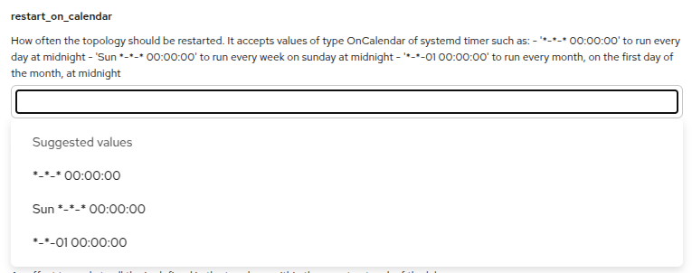

# Attribute and entity metadata


This section describes the metadata fields that can be associated with service entities, embedded entities and its attributes
and how these metadata fields can be set in the model.


## Attribute description

The attribute description metadata is useful to provide textual information about attributes. This text will be displayed in the
service catalog view of the web console.

To add a description to an attribute, create a docstring that documents the attribute. The compiler will pick this up and register
it as the description of that attribute.

For example:

```inmanta
entity Interface:
    """ A network interface

        :attr interface_name: The name of the interface
    """
    string interface_name 
end
```

A detailed example can be found {ref}`here <quickstart_orchestration_model>`.


## Attribute modifier

Adding the attribute modifier metadata lets the compiler know if:

* This attribute should be provided by an end-user or set by the orchestrator.
* This attribute's value is allowed to change after creation.

The modifier itself is defined like a regular attribute, with a few caveats:

* it should be of type lsm::attribute_modifier.
* its name should extend the decorated attribute's name with the suffix `__modifier`.
* its value should be one of the supported values:
  
  * **r**: This attribute can only be set by an allocator.
  * **rw**: This attribute can be set on service instantiation. It cannot be altered anymore afterwards.
  * **rw+**: This attribute can be set freely during any phase of the lifecycle.


Attributes modifiers can also be specified on {ref}`relational attributes <attribute_modifiers_on_a_relationship>`.


For example:

```inmanta
entity Interface :
    string interface_name 
    lsm::attribute_modifier interface_name__modifier="rw+"
end
```

A detailed example can be found {ref}`here <quickstart_orchestration_model>`.

## Annotations

Annotations are key-value pairs that can be associated with an entity (service entity or embedded entity) or an attribute
(simple attribute or relational attribute). These annotations don't influence the behavior of LSM or the Inmanta Service
Orchestrator itself, but are intended to pass meta data to other components. For example, they can be used to pass on
visualization meta-data to the the web-console to improve the user-experience.

### Annotations on entities

Annotations can be attached to an entity using the `__annotations` attribute. This attribute has the type `dict` and requires a
default value that defines the annotations. Each key-value pair in the dictionary contains respectively the name and the value
of the annotation. The value of an annotation can be any of the simple types (string, float, int, bool), lists and dicts. Note:
These values are the default values of an attribute, therefore they must be constants and cannot include variables, attribute
access or plugins.

The example below illustrates how the annotation `annotation=value` can be set on on a service entity. Annotations can be set on
embedded entities in the same way.

```inmanta
entity Interface extends lsm::ServiceEntity:
    string interface_name dict __annotations = {"annotation": "value"}
end
```

### Annotations on simple attributes

Annotations can be attached to simple (non-relational) attributes by defining an attribute of type dict, with a name
`<attribute>__annotations`, where `<attribute>` is the name of the attribute the annotations belong to. This attribute needs a
default value containing the attributes. The values of the elements in the dictionary must be strings.

The example below shows how the annotation `annotation=value` is set on the attribute `interface_name`. Annotations can be set
on simple attributes of embedded entities in the same way.

```inmanta
entity Interface extends lsm::ServiceEntity:
    string interface_name dict interface_name__annotations = {"annotation": "value"}
end
```

### Annotations on relational attributes

Annotations can be attached to a relational attribute by replacing the `--` part of the relationship definition with an instance
of the `lsm::RelationAnnotations` entity. This entity has a dict attribute `annotations` that represents the annotations that
should be set on the relational attribute. The values of this dictionary must be strings. By convention the name of the
`lsm::RelationAnnotations` instance should be prefixed and suffixed with two underscores. This improves the readability of the
relationship definition.

The example below illustrates how the annotation `annotation=value` can be attached to the relational attribute `ports`.

```inmanta
entity Router extends lsm::ServiceEntity:
    string name
end

entity Port extends lsm::EmbeddedEntity:
    number id
end

__annotations__ = lsm::RelationAnnotations(
    annotations={"annotation": "value"}
) Router.ports [0:] __annotations__ Port._router [1]
```

### Documentation tabs

Annotations can be used to have the web console render the content of one or more attributes in a tab called *Documentation*.
This can be used to document and explain details of the service to the user based on information in the orchestration model. The
attribute value is set during a compile. For example, the following LSM service orchestrates container based labs and provides
an overview of all the different services and devices in the lab.


One or more attributes at the root level can be used and they are all rendered in the documentation tab. In the example the
documentation is defined as follows:

```inmanta
entity Service extends lsm::ServiceBase:
    string documentation = "# Lab documentation"
    lsm::attribute_modifier documentation__modifier = "r"
    dict documentation__annotations = {
        "web_presentation": "documentation",
        "web_title": "Lab overview",
        "web_icon": "FaInfo",
    }
end
```

1. An attribute of type string needs to be defined. We recommend to give it a default value so that the tab is not empty when
   the documentation has not yet been generated by the compiler.
2. The attribute modifier must be `r` which means that it is not defined by the user and only by the orchestrator.
3. Annotations are used to control how the attribute is rendered in the web console:
   - `web_presentation` is set to `documentation` 
   - Optionally `web_title` is set to the title that is shown in the tab. This title is only used when multiple attributes are
     defined as documentation. This title will be used on the card that contains the content of this attribute.
   - Optionally `web_icon` specifies a [font awesome icon](https://react-icons.github.io/react-icons/icons/fa/) name (the second
     part without `fa `, for example `FaTv`).  This icon is also only used when multiple attributes are defined as
     documentation.

In the orchestrsation model a call to `lsm::update_read_only_attribute` is used to upload the content of the documentation tab.
For example:

```inmanta
instance.documentation = lsm::update_read_only_attribute(
    instance,
    "documentation",
    value=std::template(
        "./documentation.md.j2",
        instance=instance,
    ),
)
```

The content of the attribute should be valid markdown. It also supports mermaid diagrams inside the markdown. For example the
following documentation tab is generated in a template:

```markdown
```mermaid
    flowchart LR
    %%{init:{'flowchart':{'nodeSpacing': 20, 'rankSpacing': 10, 'padding': 5}}}%%
    classDef infra stroke:#4266f5, stroke-width:2px
    classDef service stroke:#42f54b, stroke-width:2px

    classDef attribute stroke:#ffffde, fill:#ffffde, color:#000
    router-east:::infra
subgraph router-east
router-east-ip:::attribute
router-east-ip[10.255.255.2]
router-east-ge-0/0/2:::infra
subgraph router-east-ge-0/0/2[ge-0/0/2]
router-east-ge-0/0/2-vlan2000:::infra
router-east-ge-0/0/2-vlan2000[vlan 2000]
end
end
router-west:::infra
subgraph router-west
router-west-ip:::attribute
router-west-ip[10.255.255.4]
router-west-ge-0/0/2:::infra
subgraph router-west-ge-0/0/2[ge-0/0/2]
router-west-ge-0/0/2-vlan2001:::infra
router-west-ge-0/0/2-vlan2001[vlan 2001]
end
end
l2connect:::service
l2-2000:::service
l2-2000[L2VPN termination: ep-0] --- l2connect[L2VPN: vpls-20000]
router-east-ge-0/0/2-vlan2000 --- l2-2000
l2-2001:::service
l2-2001[L2VPN termination: ep-1] --- l2connect[L2VPN: vpls-20000]
router-west-ge-0/0/2-vlan2001 --- l2-2001

\```

### Netbox links
├─ [router-east](http://172.25.139.95:8080/dcim/devices/?q=router-east)
&emsp; ├─ [ge-0/0/2.2000](http://172.25.139.95:8080/dcim/interfaces/?q=ge-0/0/2.2000&device=router-east)
├─ [router-west](http://172.25.139.95:8080/dcim/devices/?q=router-west)
&emsp; ├─ [ge-0/0/2.2001](http://172.25.139.95:8080/dcim/interfaces/?q=ge-0/0/2.2001&device=router-west)

```

And results in the following view:


### Suggested values

The Inmanta Service Orchestrator is API first: our web console uses the same APIs that anyone else can use to integrate.
However, for certain use case the forms generated by the web console on the LSM API provide the UI for the end user of the
automated service. In those cases it can be usefull to have more control over the forms that are generated.

A field that has an enum type will be presented in the web console as a select control with a fixed number of options. For
example, an attribute of this type:

```inmanta
typedef connection_type as string matching self in ["POINT_TO_POINT", "MULTIPOINT"]
```

Results in a form control like this:


In cases where you only want to suggest values and allow other values that are not suggested: suggested values can be used. It
exists in two flavors.

The first flavor uses a static list defined in the model. The following example adds a number of suggestions to a field that
accepts a cron like expression. These are non trivial to write and having a number of command suggestions assists the user. It
also still allows for a constrained string type with custom validation:

```inmanta
entity Service extends lsm::ServiceBase:
    cron_type? restart_on_calendar = null
    lsm::attribute_modifier restart_on_calendar__modifier = "rw+"

    dict restart_on_calendar__annotations = {
      "web_suggested_values": {
        "type": "literal",
        "values": ["*-*-* 00:00:00", "Sun *-*-* 00:00:00", "*-*-01 00:00:00"],
      },
    }
end
```

This results in a form control like this, that also provide search and autocompletion:



The annotation that controls this is `web_suggested_values` which as a value also needs a dict with two fields:
- `type` which has to be `literal`
- `values` which is a list of string values that the web console should suggest to the user. 

Because they are defined as a default value in the model, you can only provide literal strings here. It is not possible to
generate the list using a plugin. The second flavor offers dynamic suggested values based on a parameter in the orchestrator API.

It is possible to have the web console load the list of values from a parameter registered in the orchestrator. These parameters
can then be populated by the compiler or any other external system that has access to the orchestrator. The following example is
taken from a service that supports a number of topology files that are part of a folder in an inmanta module. When the
orchestrator commpiles the model, it updates the list based on what is available in the module. This is defined as follows:

```inmanta
entity Service extends lsm::ServiceBase:
    string topology_file
    lsm::attribute_modifier topology_file__modifier = "rw+"
    dict topology_file__annotations = {
        "web_suggested_values": {
            "type": "parameters",
            "parameter_name": "topology_files",
        },
    }
```

This results in a form control like this, which also provides search and autocompletion:


The suggested values are uploaded by adding the following code to the compiler:

```inmanta
import lsm

# Set the suggested values for the topology files
lsm::set_suggested_values(
    "topology_files",
    custom_module::all_matching_files("docker-compose.*.yml"),
)
```

The annotation that is required is also `web_suggested_values` which is also a dict that requires two fields:
- `type` which has to be `parameters`
- `parameter_name` which points to the parameter name in our parameter API endpoint.

The values are expected by the frontend in the `metadata` field of the parameter under the `values` key. For the example above
the API returns the following structure:

```json
[
    {
        "id": "1b0b1d37-abef-4e5f-8100-84ebf4c65f93",
        "name": "topology_files",
        "value": "metadata",
        "environment": "f81be80b-8582-499f-b002-7cdd2f2df98a",
        "source": "user",
        "updated": "2025-03-14T13:23:11.475925+00:00",
        "metadata": {
            "values": [
                "source://labs/docker-compose.irrd.yml",
                "source://labs/docker-compose.iso-dev.yml",
                "source://labs/docker-compose.iso7-dev.yml",
                "source://labs/docker-compose.iso8-dev.yml",
                "source://labs/docker-compose.iso9-dev.yml",
                "source://labs/docker-compose.netbox-3.7.yml",
                "source://labs/docker-compose.netbox-4.1.yml",
            ]
        }
    }
]
```

The `lsm::set_suggested_values` plugin takes care for wrapping the values and setting the value correctly.