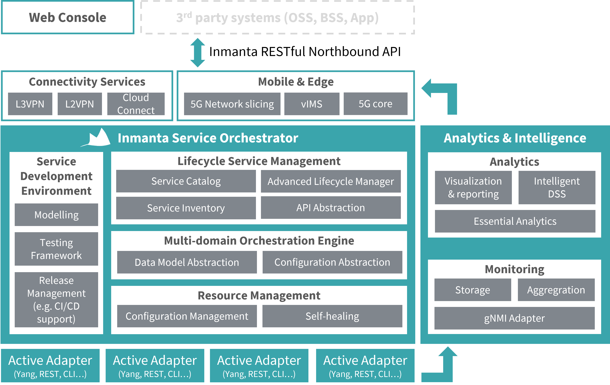

..
    The lsm directory is excluded from the oss doc build via the exclude_patterns variable in conf.py

Inmanta Lifecycle Service Manager
*********************************

The Inmanta LSM is an active component that governs the lifeycle of services in the orchestration model. LSM extends the
Orchestration Engine (OrE) and Resource Controller (ResC) with a service catalog, a service inventory and a lifecycle manager.

The Resource Controller manages the low level desired state of individual resources in the managed infrastructure. This desired
state is defined by the orchestration engine. The orchestration engine is responsible for the translation of high level desired
state into low level desired state, based on a library of refinements.

The LSM makes the orchestator service aware: the orchestration engine can control the refinement process per service instance
and change the refinement process based on external events.

.. toctree::
    :glob:
    :maxdepth: 1

    quickstart/*
    allocation/*
    embedded_entities/*
    inter_service_relations/*
    partial_compiles/partial_compiles.rst
    troubleshooting/*
    limitations/*
    lifecycle/*
    attributes_metadata/*
    validation_types/*
    service_identity
    state_transfer_tx
    transfer_optimization/*

Service catalog
---------------

The service catalog contains all defined service entities. A service entity models a service offered by the infrastructure.
A service entity is the definition of the service: its attributes and the lifecycle of the service. A service entity is created
by marking an inmanta entity in a service model as a service entity and associate it with a service lifecycle. The orchestration
layer will take care of defining and maintaining the definition in the service catalog.

A service entity models the following properties for a service:

- The name of the service entity
- A list of attributes that have a name, a type (number, string, ...) and a modifier. This modifier determines whether the attribute is:
    - ``r`` / readonly: readonly from the client perspective and allocated server side by the LSM
    - ``rw`` / read-write: Attributes can be set at creation time, but are readonly after the creation
    - ``rw+`` / read-write always: Attribute can be set at creation time and modified when the service state allows it
- The :ref:`fsm` that defines the lifecycle of the service.

For each service entity the lifecycle service manager will create an REST API endpoint on the service inventory to perform create,
read, update and delete (CRUD) service instances of service entities.

Creating service entities
=========================
Service entities are :ref:`entities <lang-entity>` that extend ``lsm::ServiceEntity``
We define attributes for the service entity the same way as for entities. We can also define a modifier for the attribute.
If no modifier is defined for an attribute, it will be ``rw`` by default.
Here is an example of an entity definition where the modifier of the ``address`` attribute is set to ``rw+``.

.. literalinclude:: index_sources/service_creation.cf
    :linenos:
    :language: inmanta
    :lines: 1-29

We also need to add a lifecycle and a name to the service. This is done by creating an instance of the ``ServiceEntityBinding`` entity:

.. literalinclude:: index_sources/service_creation.cf
    :linenos:
    :language: inmanta
    :lines: 30-36
    :lineno-start: 25

It's also possible to define a service identity for a service. For more information, see :ref:`service_identity`.

..
    TODO:
    Updating service entities
    =========================
    How to update the definition of a service entity and keeping the instance in the inventory stable

Service Inventory
-----------------
The service inventory provides an inventory with all service instances per service entity defined in the catalog. The inventory
provides operations to create and delete the service instance and to update the attributes of the service instance.
Additionally, it governs the lifecycle of the instance as defined in the lifecycle registered in the service catalog.

CRUD operations
===============

The service inventory exposes CRUD operations on service instances in the inventory through a RESTful API:

- ``GET /lsm/v1/service_inventory/<service_entity>``: List all instances of a service entity
- ``POST /lsm/v1/service_inventory/<service_entity>``: Create a new service entity
- ``GET /lsm/v1/service_inventory/<service_entity>/<service_id>``: Get the current state of the service instance with id ``service_id``
- ``PATCH /lsm/v1/service_inventory/<service_entity>/<service_id>``: Update the attributes of the service instance with id ``service_id``
- ``DELETE /lsm/v1/service_inventory/<service_entity>/<service_id>``: Delete the service instance with id ``service_id``
- ``POST /lsm/v1/services/<service_type>/<service_id>/state``: Request a state transfer for the service instance with id ``service_id``

The state machine attached to the lifecycle will determine whether the API call is successful or not.

..
    TODO: Three set of attributes

Lifecycle Manager
-----------------

..
    TODO: add example/default lifecycle

.. _fsm:

State machine
=============

The lifecycle of service instance is governed by a state machine. A state machine is represented as a directed graph: the
nodes represent the different service states and the edges represent the possible transfers that are allowed. The states
determine how the service instance is treated in the orchestration engine and the transfers determine what operations are
possible on a service instance.

Each service instance is in a state defined in the lifecycle state machine attached to the service entity. The state defines how
the orchestration engine handles that specific service instance in its refinement process. The orchestration engine can refine
a full orchestration model in two modes:

- validation: It validates the orchestration model but does not generate a resource model for the resource controller.
- production: It validates the orchestration model and generates a resource model that the resource controller deploys and enforces on the managed infrastructure.

The value of the ``model_state`` attribute of the state determines how the service instance is handled by the orchestration
engine:

- ``inactive``: never include this instance in the orchestration model.
- ``candidate``: include the instance in validation mode. In validation mode the candidate set of attributes are used. Only this candidate and all designed and active instances are included in the orchestration model.
- ``designed``: this indicates a candidate is accepted and is queued to become active in the model. It is included in validation mode but its resources are not yet pushed to the resource controller. The orchestration engine uses the candidate attribute set.
- ``active``: include in both modes (validate and production). The orchestration engine uses the active attribute set.

Once a service instance goes to active the lifecycle should also support updates. A service instance has three sets of attributes
to support this: candidate, active and rollback. When the service instance is in candidate and designed mode but it has attributes
in the active set, they are included in production mode with their active attribute set. The target_operation and error_operation
action on state transfers control the contents of these attribute sets. These operations are discussed later on.

.. With this mechanism xxx can be ... make sure all instances follow the same

Transfers between states determine how the lifecycle of the service instance reacts on external events. Each transfer has a
source state, a target state and an error state. The following events can trigger a state transfer:

- the creation of the service instance: The state of the new service instance is set to the start state defined in the state machine. Set attributes provided with the API call are stored in the candidate_attributes set of the instance.
- ``auto``: This transfer is automatically performed when the lifecycle arrives in the source state. Auto transfers can be disabled by adding a configuration option.
- ``api set state`` call: When a set state API call is performed with matching source and target states
- ``on_update``: Transfers marked as on_update are executed when a PATCH is performed on a service instance. The update attributes are stored based on the target_operation or error_operation attribute.
- ``on_delete``: Transfers marked as on_delete are executed when a DELETE is performed on a service instance.
- resource based: This transfer is triggered when the orchestrator finishes deploying the resources that this service instance consists off.

The auto and api set state call can set the validation attribute to true. When this attribute is true,
the orchestration engine refines the model in validation mode. When the validation succeeds the state transfers to the target
state, if the validation fails the state transfers to the error state.

On each transfer the lifecycle manager can apply operations to the three attribute sets. These operations can be defined
on a transfer to target with target_operation or to error with error_operation. On creation and update the attributes provided
through the API are stored in candidate_attributes. For all other transitions the following operations are available:

- ``clear <setname>``: Clear the given attribute set. Setname is one of the following: candidate, active or rollback
- ``promote``: Promote the values in candidate to active and active to rollback.
- ``rollback``: Do a roll back of the attributes by setting the values from rollback to active and active to candidate.

On every state transfer the version of the service instance is incremented.

Patterns
--------

- Validating with intermediary state
- Batched with on error serial

Glossary
--------

.. glossary::
    :sorted:

    lifecycle
        A formal description of all the states a service instance can be in, between creation and deletion and the possible
        transfers between the states.

    trigger
        A trigger is an external event that causes a service instance to transfer to a next state in its lifecycle. A trigger
        can be an external API call or the orchestrator finishing a deploy of the resources the service consists of.

    state
        A service instance is always in a state defined in the lifecycle state machine. This state determines how the service
        instance behaves.

    transfer
        A :term:`state` transfer from one state to another. Transfers are used to connect events with a state transfer.

    state machine
        The lifecycle of a service is modelled as a state machine. This state machine consists of :term:`states<state>` the
        service can be in and :term:`transfers<transfer>` from a source state to a destination state.

    service entity
        In the Inmanta lifecycle service manager multiple service entities are registered from an orchestration model. A service
        entity defines the attributes of a :term:`service instance` and the lifecycle state machine.

    service instance
        The lifecycle manager manages the lifeycle of service instance.

Dict Path Library
-----------------

This extension also uses the :ref:`Dict Path library<dict_path>`. This library can be used to extract or modify specific elements
from an arbitrary location in a nested dictionary-based data structure.

.. _partial_compile_lsm:

Partial Compiles
----------------
Partial compiles are an advanced feature that allow increased scaling in the number of services. Instead of triggering
compiles for the full model whenever a service instance is created, updated or has a state transfer, only the part of the
model relevant for that service instance is recompiled.

LSM expands on the normal :ref:`resources set based partial compiles<partial_compile>` by automatically creating a single
resource set for each service instance. To add resources to the instance's resource set, simply add them to its
``owned_resources`` relation and make sure to select the ``parents`` implementation for your service entities. LSM will then
make sure to populate the resource set and to correctly trigger related compiles and exports.

For more advanced scenarios, refer to :ref:`the lsm partial compile section<partial_compile_lsm_sec>`.

For a more generic introduction to partial compiles (without lsm), including resource set semantics, modelling guidelines
and how to approach testing, refer to the generic :ref:`partial compiles<partial_compile>` section.

Finally, to enable lsm's partial compiles on the server, set the :inmanta.environment-settings:setting:`lsm_partial_compile`
environment setting to true.

