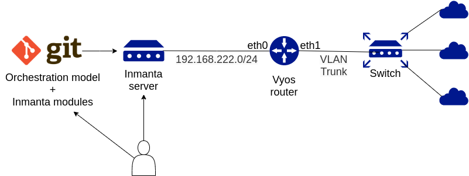
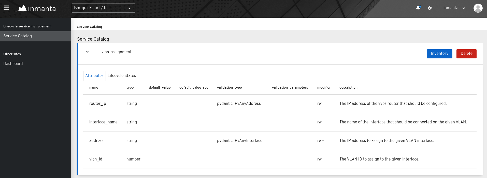
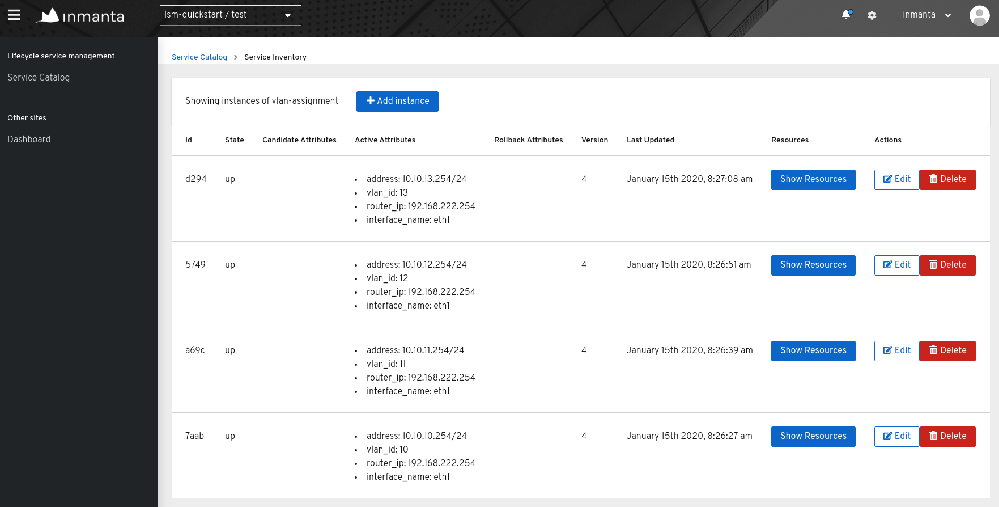
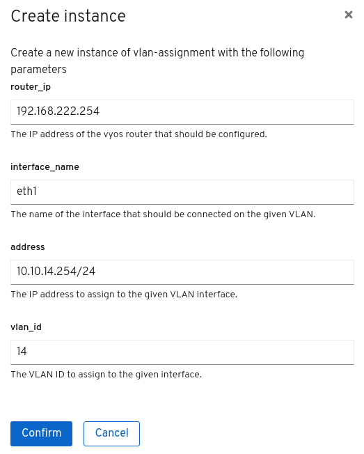

**************
LSM quickstart
**************

This document provides a quickstart for the Inmanta lifecycle service manager (LSM). A high-level overview will be given on how
Inmanta LSM can be used to model and provision new services within a certain infrastructure. This quickstart considers a basic
service, which manages the different VLANs in a network.

Overview setup
##############

The figure shown below, gives an overview of the infrastructure required to execute this quickstart.
The infrastructure consists of:

1. A git server to host the model code
2. An Inmanta Service Orchestrator with LSM
3. A Vyos router to configure
4. An internet connection

The Inmanta service orchestrator has access to several Git repositories. One Git repository contains the orchestration
model. This is a definition of the service that can be provisioned using Inmanta LSM. The dependencies of the orchestration
model should also be stored on a Git repository as an Inmanta module.

The VyOS router in this setup has two interfaces: ``eth0`` and ``eth1``. ``eth0`` is the management interface of the router.
This interface is reachable by the Inmanta orchestrator over the management network (192.168.222.0/24). The ``eth1``
interface is connected to a switch via a VLAN trunk.

The service modelled in the following section manages the association of VLANs to the ``eth1`` interface of the VyOS router.
A possible extension of this service would also manage the VLANs assigned to the different ports of the switch shown in the
overview.

.. _quickstart_orchestration_model:

Orchestration model
###################

The full orchestration model to attach a VLAN to an interface of a VyOS router, is shown below.

.. code-block:: inmanta
    :linenos:

    import lsm
    import lsm::fsm
    import vyos
    import net

    entity VlanAssignment extends lsm::ServiceEntity:
        std::ipv_any_address router_ip
        string router_ip__description="The IP address of the vyos router that should be configured."

        string interface_name
        string interface_name__description="The name of the interface that should be connected on the given VLAN."

        std::ipv_any_interface address
        string address__description="The IP-address/netmask to assign to the given VLAN interface."
        lsm::attribute_modifier address__modifier="rw+"

        net::vlan_id vlan_id
        string vlan_id__description="The VLAN ID to assign to the given interface."
        lsm::attribute_modifier vlan_id__modifier="rw+"
    end

    index VlanAssignment(router_ip, interface_name, vlan_id)

    implement VlanAssignment using vlanAssignment
    implement VlanAssignment using parents

    implementation vlanAssignment for VlanAssignment:
        host = vyos::Host(name="vyos", user="vyos", password="vyos", port=22, ip=self.router_ip)
        interface = vyos::Interface(name=self.interface_name, host=host)
        v_interface = vyos::Vif(vlan=self.vlan_id, address=self.address, dhcp=false, parent=interface, purge_on_delete=false)
        self.resources = [interface.config]
    end

    binding = lsm::ServiceEntityBinding(
        service_entity="__config__::VlanAssignment",
        lifecycle=lsm::fsm::simple,
        service_entity_name="vlan-assignment",
    )

    for assignment in lsm::all(binding):
        VlanAssignment(
            instance_id=assignment["id"],
            router_ip=assignment["attributes"]["router_ip"],
            interface_name=assignment["attributes"]["interface_name"],
            address=assignment["attributes"]["address"],
            vlan_id=assignment["attributes"]["vlan_id"],
            entity_binding=binding,
        )
    end

* Lines 1 to 4 import several modules required by this configuration model.
* Lines 6 to 20 define the API of the new service, i.e. the attributes required to instantiate a new instance of the
  service. The VlanAssignment entity defines four attributes: router_ip, interface_name, address and vlan_id. Each
  attribute has a description defined in the "<attribute>__description" field. The description fields are meta-data fields
  that provide documentation on the meaning of a specific service attribute. The "<attribute>__modifier" fields are also a
  meta-data fields. They defines whether the attribute can be modified or not. In the above-mentioned orchestration model,
  the  router_ip and the interface_name attribute can only be set upon instantiation of the model, while the address and the
  vlan_id attribute can be changed during the lifetime of the service. More information on attribute modifiers can be
  found :ref:`here<attributes_metadata_attribute_modifiers>`.
* Line 22 puts an :ref:`index<language_reference_indexes_and_queries>` on the VlanAssignment entity. This will prevent the
  instantiation of two services, which request a different address on the same interface of a certain VyOS router using the
  same VLAN ID. If this happens the second service instantiation will be rejected by the Inmanta orchestrator.
* Lines 24 to 25 define which implementation should be used to instantiate the VlanAssignment service entity.
* Lines 27 to 32 provide the actual implementation for the VlanAssignment service entity. If an instance is created of the
  VlanAssignment service entity, this implementation will make sure that address and VLAN ID specified in the attributes of the
  service instance, will be configured on the requested interface and VyOS router. The resources field should contain the list
  of resources that need to be deployed before the state of the instance can be moved from *creating* to *up*. The
  ``interface.config`` resource does the actual configuration of the ``eth0`` interface.
* Lines 34 to 38 create a service entity binding. It associates a name and a lifecycle to the VlanAssignment service entity
  and registers it in the Inmanta Service Orchestrator via its northbound API. More information on service lifecycles can be
  found TODO.
* Lines 40 to 49 create an instance of the VlanAssignment entity for each service instance. The ``lsm::all()`` plugin
  retrieves all the service instances via the Inmanta Service Orchestrator API.

Export the orchestration model to the Inmanta server
####################################################

The following commands create a new project *lsm-quickstart* and a new environment *test* in the Inmanta orchestrator.

.. code-block::

    $ inmanta-cli project create -n lsm-quickstart
    $ inmanta-cli environment create -n test -p lsm-quickstart -r https://github.com/inmanta/lsm-quickstart.git -b master --save

The following commands exports the orchestration model to the inmanta orchestrator. As such, the new vlan-assignment service is
known by the Inmanta orchestrator. Instances of this service can be requested via the LSM API or via the Inmanta
web-console.

.. code-block::

    $ git clone https://github.com/inmanta/lsm-quickstart.git
    $ cd lsm-quickstart
    $ inmanta project install # skip this step for inmanta-service-orchestrator<5
    $ inmanta -vv export --export-plugin service_entities_exporter

After executing the export command, the vlan-assignment service will appear in the service catalog of the Inmanta
web-console as shown in the figure below.

The attribute overview shows that a validation type is associated with the router_ip and the address attributes, while this
is not the case for the other attributes. When a validation type is present, the type of the attribute is validated by the
Inmanta API. When no validation type is present, the validation will happen during a validation compile. More information
about validation types can be found :ref:`here<validation_types>`.

Create a new service instance
#############################

Login on the VyOS router using the username "vyos" and password "vyos".

.. code-block::

    $ ssh vyos@192.168.222.254

Check the interface configuration via the following command. Note that VLANs 10 to 13 are already associated with the eth1
interface in the output shown below.

.. code-block::

    vyos@vyos:~$ show interfaces ethernet
    Codes: S - State, L - Link, u - Up, D - Down, A - Admin Down
    Interface        IP Address                        S/L  Description
    ---------        ----------                        ---  -----------
    eth0             192.168.222.254/24                u/u
    eth1             -                                 u/u
    eth1.10          10.10.10.254/24                   u/u
    eth1.11          10.10.11.254/24                   u/u
    eth1.12          10.10.12.254/24                   u/u
    eth1.13          10.10.13.254/24                   u/u

Now, we will provision a new instance of the vlan-assignment service via the Inmanta web-console. Click on the *inventory*
button after the vlan-assignment service and click on the *Add instance* button.

Fill in the required attributes and click on confirm.

The service will be deployed automatically after clicking the *confirm* button. During the deployment, the service instance
will move through different states of its lifecycle: start -> acknowledged -> creating -> up. When the service is in the up
state, the interface is configured successfully. Verify the configuration on the VyOS router.

.. code-block::

    vyos@vyos:~$ show interfaces ethernet
    Codes: S - State, L - Link, u - Up, D - Down, A - Admin Down
    Interface        IP Address                        S/L  Description
    ---------        ----------                        ---  -----------
    eth0             192.168.222.254/24                u/u
    eth1             -                                 u/u
    eth1.10          10.10.10.254/24                   u/u
    eth1.11          10.10.11.254/24                   u/u
    eth1.12          10.10.12.254/24                   u/u
    eth1.13          10.10.13.254/24                   u/u
    eth1.14          10.10.14.254/24                   u/u
