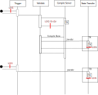

# State Transfer Transactional Behavior

This document provides the highlights of how the transactional and logging behavior is intended and implemented.

Three important aspects are taken into account

1. *API behavior*: Async style, a valid request is accepted with a 200 return but this does not imply a successful transfer.
To verify if a transfer is successful, study the event log.
2. *Event Log*: The event log is the primary mechanism to provide feedback to operators/users. It logs all triggers and all state transfers. 
Errors while starting a validation are also logged, as they abort the flow.  
3. *Transactions*: the state transfer itself is a transaction, the associated event logging is performed in a parent transaction. 

   * In case of success, both the log line and state transfer are present. 
   * In case of transition failure, the sub transaction is aborted and failure is logged in the parent transaction.
   * In case of orchestrator failure, either log and state transfer are present or completely absent.

In the scenario, where the server crashes after an api_set_state has returned success, but before it was executed, the api_set_state operation is lost.
** The log needs to be checked to ensure transfer **

## Self transitions

A self transition with no action is not executed, as the state is not changed in any way.

If we would make self transition increment the state version, we would get stuck in a 'recompile storm' by resource based transaction that are triggered by repair runs.

## Auto transition

Auto transitions are triggered after the state transfer transaction is committed.
If the server fails right after the transfer, it is lost. 

At server startup, the auto transitions are recovered.
(i.e. all instances are checked)

This recovery has to take into account that validations are ALSO recovered.
To this effect, the validation correlation ID on auto transfers are uuid3(instanceid, intancestateversion)

## Operations

promote is only valid if there is a candidate
rollback is only valid if there is a rollback set

## Logging

For each event

1- event arrival is logged if the event is accepted (i.e. returns 200) 