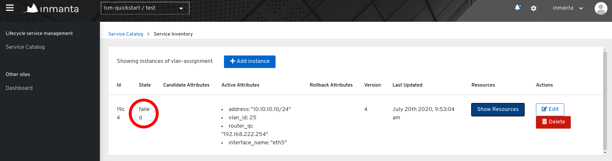
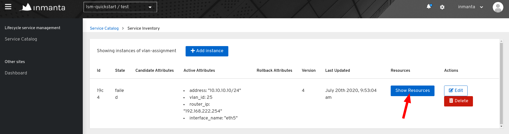
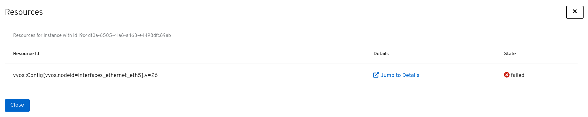
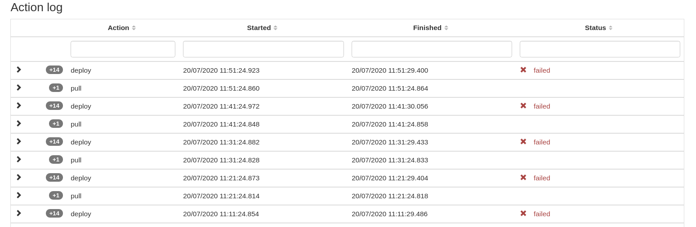
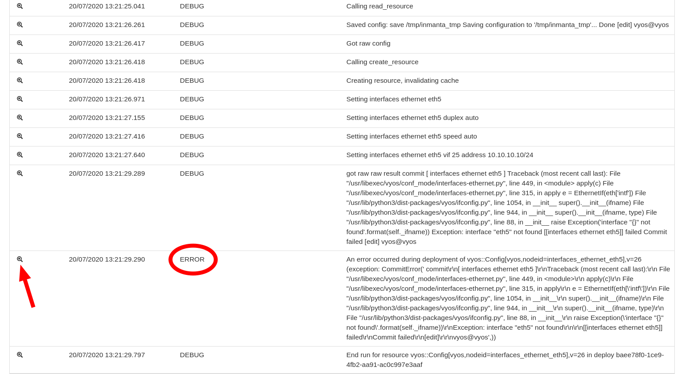
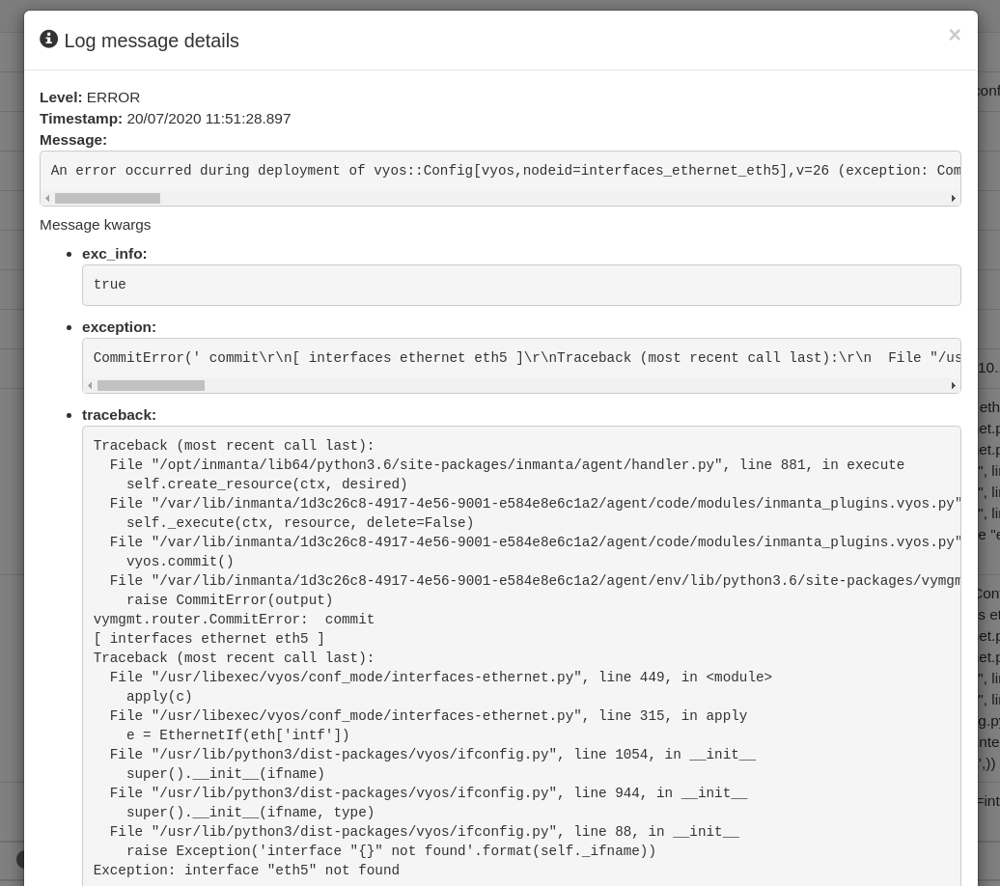

***************
Troubleshooting
***************

This page provides information on how to troubleshoot certain issues with Inmanta LSM in an efficient way.

Deployment failure
##################

This section describes what should be done when one of the resources of a certain service instance fails. First we explain how
deployment failure can be detected. The second section describes how a root cause analysis can be done via the Web
Console, the CLI and the API.

Detect deployment failure
=========================

The easiest way to detect deployment failure is by looking at the state of a service instance. When the lifecycle of a service
instance is modelled in such a way that the service instance enters a certain state when failure occurs, it will be easy to
detect failure by looking at the state of the service instance. In the figure below, the service instance entered the failure
state which indicates deployment failure.

Determine the root cause of the deployment failure
==================================================

The root cause of a deployment failure can be examined via three different interfaces: the Web Console, the Inmanta client and
the rest API. Each of the sections below discuss the procedure for a specific interface.

Web Console
-----------

The resources that should be deployed to trigger a resource-based transfer for a specific service instance, can be obtained via
the inventory of that service instance. The figure below shows an entry in the service inventory which contains service
instances of the service type ``vlan-assignment``. The service instance is in the state ``failed`` which indicates that a
deployment failure has occurred.

Click on the *Show Resources* button to get an overview of the different resources which are part of the
resource-based transfer. This overview shows each resource, together with its deployment state. The example below only contains
a single resource with the deployment state ``failed``.

When a resource ends up in the failed state, more information on the root cause of the failure can be obtained via the *Jump To
Details* button. This button opens the Inmanta Dashboard and shows all the details of the failed resource, including the action
log. The figure below shows the action log for the failed resource.

Each action in the action log can contains several log entries. Open the logs for the latest *deploy* action by clicking on the
arrow in front of the resource action. These log entries are produced by the orchestrator itself as well as by the handler
performing the deploy operation for that specific resource. The figure below shows the log entries for the deploy action.

The log entry with the log level ERROR gives information about what went wrong during the deployment of the resource. Click on
the magnifying glass in front of the log entry to get a full stack trace of the error.

Inmanta client
--------------

The `lsm_services_diagnose` API method returns a diagnosis for a given service instance. It contains among others an overview
of errors during the validation compile that caused the rejection.

Rest API
--------

The `http://<host>:<port>/lsm/v1/service_inventory/<service_entity_name>/<instance_id>/diagnose` endpoint returns a diagnosis
similar to the one described in the previous section.

Validation failure
##################

If a service instance does not move through the expected lifecycle states but instead enters a rejected state, this means a
validation failure occurred. This section describes how to detect and find the cause for validation failures.

Detect validation failure
=========================

When a validation failure occurs for a service instance, it will enter a rejected state. Each lifecycle transfer may have an
associated rejected state, the convention is to include "rejected" in the name of the state. All lifecycles defined in this
module follow this convention. Example states are `rejected`, `update_rejected` and `update_rejected_failed`.

Determine the cause of the validation failure
=============================================

This section documents two ways to find the exception that caused the validation compile to fail. The first uses the
Inmanta client from Python code, the second uses the REST API directly.
The general procedure is the following: first, find the latest event (according to the `timestamp` field) for the
current version with a compile id. Then use that id to pull in the compile report.
Then, for the error message look at the report's compile data. For a trace look in the report for the
error stream for the compile stage that failed (return code other than zero).

Inmanta client
--------------

The `lsm_services_diagnose` API method returns a diagnosis for a given service instance. It contains among others an overview
of relevant resource failures.

Rest API
--------

The `http://<host>:<port>/lsm/v1/service_inventory/<service_entity_name>/<instance_id>/diagnose` endpoint returns a diagnosis
similar to the one described in the previous section.
