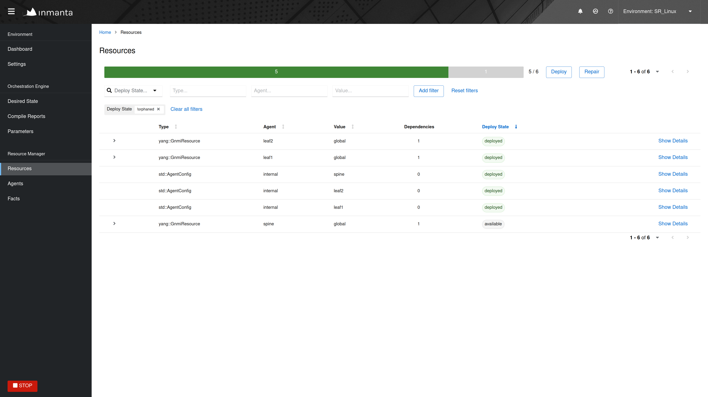
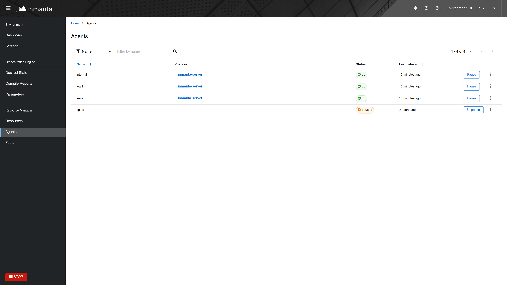
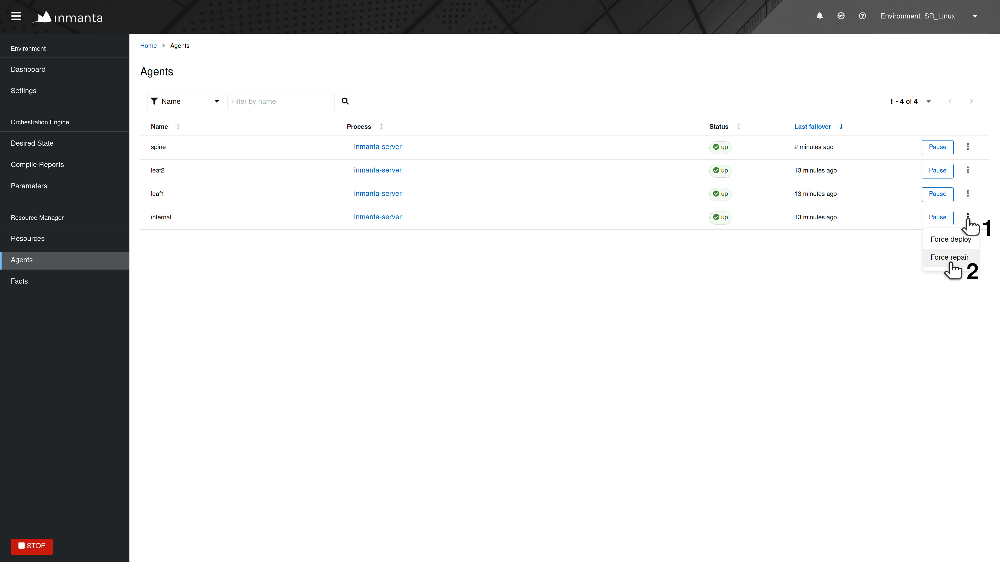
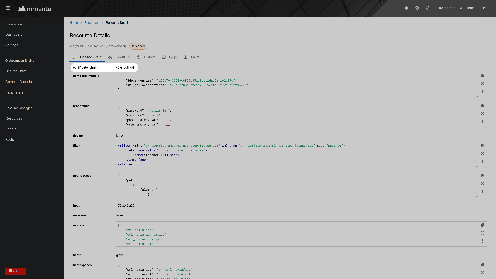
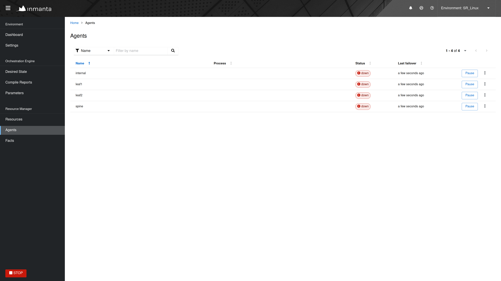

.. _troubleshooting:

***************
Troubleshooting
***************

This page describes typical failure scenario's and provides a guideline on how to troubleshoot them.

A resources is stuck in the state available
===========================================

When a resource is stuck in the available state, it usually means that the agent, which should deploy the resource, is currently
down or paused. Click on the version of the configuration model, shown in the versions tab of the Inmanta dashboard, to get an
overview of the different resources in the model. This overview shows the state of each resource and the name of its agent.
Filter on resources in the available state and check which resource are ready to be deployed (i.e. a resource without
dependencies or a resource for which all dependencies were deployed successfully). The agent of that resource, is the agent that
causes the problem. In the figure below, the epel-release package should be ready to deploy on agent vm2

Next, go to the agents tab of the dashboard to verify the state of that agent.

An agent can be in one of the following states:

* Down
* Paused
* Up

Each of the following subsections describes what should be done when the agent is in each of the different states.

The agent is down
-----------------

The Section :ref:`Agent doesn't come up<agent_doesnt_come_up>` provides information on how to troubleshoot the scenario where an
agent that shouldn't be down is down.

The agent is paused
-------------------

Unpause the agent by clicking the ``Unpause agent`` button in the agents tab of the dashboard.

The agent is up
---------------

When the agent is in the up state, it should be ready to deploy resources. Read the agent log to verify it doesn't contain
error or warning messages that would explain why the agent is not deploying any resources. For auto-started agents, three
different log files exist. The log files are present in ``<config.log-dir>/agent-<environment-id>.[log|out|err]``. The
environment ID can be found in the URL of the dashboard. More information about the different log files can be found
:ref:`here<administrators_doc_logging>`. For manually started agents the log file is present in
``/var/log/inmanta/agent.log``. If the log file doesn't provide any more information, trigger the agents to execute a
deployment by clicking on the ``Force Repair`` button in the versions tab of the dashboard, as shown in the figure below:

When the agent receives the notification from the server, it writes the following log message in its log:

.. code-block:: text

    INFO     inmanta.agent.agent Agent <agent-name> got a trigger to update in environment <environment ID>

If the notification from the server doesn't appear in the log file of the agent after clicking the ``Force Repair`` button, the
problem is situated on the server side. Check if the server log contains any error messages or warning that could explain
the reason why the agent didn't get a notification from the server. The server log file is situated at
``<config.log-dir>/server.log``.

The deployment of a resource fails
==================================

When a resource cannot be deployed, it ends up in one of the following deployment states:

* **failed:** A resource ends up in the ``failed`` state when the handler of that resource raises an uncaught exception.
  :ref:`Check the log of the resource<read_resource_log>` to get more details about the issue.
* **unavailable:** A resource ends up in the ``unavailable`` state when no handler could be found to deploy that resource.
  :ref:`Check the log of the resource<read_resource_log>` to get more details about the issue.
* **undefined:** A resource ends up in the ``undefined`` state when a fact, required by that resource didn't yet resolve to a
  value. Read Section :ref:`Check which facts are not yet resolved<check_which_fact_didnt_resolve>` to find out which fact is
  still unknown.
* **skipped:** When a resource is in the ``skipped`` state, it can mean two different things. Either the resource cannot be
  deployed because one of its dependencies ended up the failed state or the handler itself raised a SkipResource exception to
  indicate that the resource in not yet ready to be deployed. The latter case can occur when a VM is still booting for example.
  :ref:`Check the log of the resource<read_resource_log>` to get more information about actual root cause.
* **skipped_for_undefined:** The ``skipped_for_undefined`` state indicates that the resource cannot be deployed because one of
  its dependencies cannot be deployed. :ref:`Check the log of the resource<read_resource_log>` to get information about the
  actual dependency that cannot be deployed.

.. _read_resource_log:

Read the logs of a resource
---------------------------

This section describes how to obtain the logs for a specific resource. In the versions tab of the dashboard, click on the
version of the configuration model being deployed to get a list of all the resource in that configuration model. Next, click on
the magnifier in front of a resource, as shown in the figure below, to get the logs for that specific resource. The log messages
for the different stages of the deployment are grouped together.

.. figure:: ./_static/troubleshooting/get_logs_failed_resource.png
   :width: 100%
   :align: center

The magnifier in front of each log message can be used to get a more structured output for that specific log message.

In the figure below, the traceback of the exception is shown.

.. _check_which_fact_didnt_resolve:

Check which facts are not yet resolved
--------------------------------------

To find out which fact of a certain resource is not yet resolved, click on the magnifier in front of the resource in the
``undefined`` state, as shown in the figure below.

The list of attributes of that resource, will contain one attribute which is marked as undefined (See figure below). This is the
attribute that wasn't resolved yet. Track the source of this attribute down within the configuration model to find out why this
attribute is undefined.

.. _agent_doesnt_come_up:

Agent doesn't come up
=====================

This section explains how to troubleshoot the problem where an agent is in the down state while it should be up. In the figure
shown below, the agent vm1 is down.

Agents can be started in two different ways, either automatically by the inmanta server (auto-started agents) or manually
(manually-started) agents. More information about the configuration of both types of agent can be found on
:ref:`this page<configure_agents>`. The Section :ref:`Auto-started agents<autostarted_agents>` describes how to troubleshoot
this issue for agents started by the Inmanta server. The Section :ref:`Manually-started agents<manually_started_agents>`
describes how to troubleshoot this issue for agents that were started manually.

.. _autostarted_agents:

Auto-started agents
-------------------

An auto-started agent is only started when that agent is present in the ``autostart_agent_map`` environment setting. Verify that
requirement via the settings tab of the inmanta dashboard as shown in the figure below.

.. figure:: ./_static/troubleshooting/environment_settings_autostart_agent_map.png
   :width: 100%
   :align: center

When the ``autostart_agent_map`` is configured correctly, but the agent is still not up, read the logs of the auto-started agent
. These logs can be found at the following location: ``<config.log-dir>/agent-<environment-id>.[log|out|err]``. The
environment ID is present in the URL of the dashboard. More information about the different log files can be found
:ref:`here<administrators_doc_logging>`. When reading those log files, pay specific attention to error
messages and warnings that could explain why the agent is marked as down. Also, ensure that the name of the agent under
consideration is added as an endpoint to the agent process. The log file should contain the following message when a certain
agent is added as an endpoint to the process:

.. code-block:: text

    inmanta.agent.agent Adding endpoint <agent-name>

When the agent is not added as an endpoint, log an issue on https://github.com/inmanta/inmanta-core/issues.

An autostarted-agent connects to the Inmanta server via the address configured in the
:inmanta.config:option:`server.server-address` config option. If this option is set incorrectly, the agent will not be able to
connect to the server.

.. _manually_started_agents:

Manually started agents
-----------------------

When a manually-started agent doesn't come up, verify whether the agent process is still running via the following command:

.. code-block:: sh

    $ systemctl status inmanta-agent

If the agent process is down, start and enable it via the following command:

.. code-block:: sh

    $ systemctl enable --now inmanta-agent

Also check the log file of the manually-started agent. This log file is located at ``/var/log/inmanta/agent.log``. The standard
output and the standard error streams produced by the agent, can be obtained via journalctl:

.. code-block:: sh

    $ journalctl -u inmanta-agent

Potential reasons why an agent doesn't start
--------------------------------------------

This section provides a list of potential reasons why an agent wouldn't start:

* **bind-address set incorrectly:** The Inmanta server listens on all the interfaces configured
  via the :inmanta.config:option:`server.bind-address` option. If the server doesn't listen on an interface used by a remote
  agent, the agent will not be able to connect to the server.
* **Authentication issue:** If the Inmanta server has been setup with authentication, a misconfiguration may deny an agent
  access to the Inmanta API. For example, not configuring a token provider (issuer) with ``sign=true`` in the ``auth_jwt_<ID>``
  section of the Inmanta configuration file. Documentation on how to configure authentication correctly can be found
  :ref:`here<auth-setup>`.
* **SSL problems:** If the Inmanta server is configured to use SSL, the Agent should be configured to use SSL as well (See the
  SSL-related configuration options in the :inmanta.config:group:`server` and :inmanta.config:group:`agent_rest_transport`
  section of the Inmanta configuration reference)
* **Network issue:** Many network-related issue may exist which don't allow the agent to establish a connection with the Inmanta
  server. A firewall may blocks traffic between the Inmanta agent and the server, no network route may exist towards the Inmanta
  server, etc.

No version appears after recompile trigger
==========================================

After clicking the ``Recompile`` button of the dashboard, a new version of the configuration model should appear in the list of
versions. If this doesn't happen, the compilation has failed. Click on the ``Compile Reports`` button, as shown in the
figure below, to get the compile report of the latest compilation. This report will give more information about the exact
problem.

.. figure:: ./_static/troubleshooting/compile_report_button.png
   :width: 100%
   :align: center

Each step of the compile process is shown, together with the output produced by that step and the return code. Verify that the
timestamp of the compile report corresponds to the time the compilation was triggered in the dashboard. If no compile report was
generated or the compile report doesn't show any errors, check the server logs as well. By default the server log is present in
``<config.log-dir>/server.log``.

.. figure:: ./_static/troubleshooting/compile_report.png
   :width: 100%
   :align: center

Logs show "empty model" after export
====================================

This log message indicates that something went wrong during the compilation or the export of the model to the server. To get
more information about the problem, rerun the command with the ``-vvv`` and the ``-X`` options. The ``-vvv`` option increases
the log level of the command to the DEBUG level and the ``-X`` option shows stack traces and errors.

.. code-block:: sh

   $ inmanta -vvv export -X

Compilation fails
=================

In rare situations, the compiler might fail with a ``List modified after freeze`` or an
``Optional variable accessed that has no value`` error, even thought the model is syntactically correct. The following
sections describe why this error occurs and what can be done to make the compilation succeed.

Reason for compilation failure
------------------------------

When the compiler runs, it cannot know upfront how many elements will be added to a relationship. At some stages of the
compilation process the compiler has to guess which relations are completely populated in order to be able to continue
the compilation process. Heuristics are being used to determine the correct order in which relationships can be
considered completely populated. In most situation these heuristics work well, but in rare situations the compiler
makes an incorrect decision and considers a relationship to be complete while it isn't. In those situation the compiler
crashes with one of the following exception:

* ``List modified after freeze``: This error occurs when a relationship with an upper arity larger than one was
  considered complete too soon.
* ``Optional variable accessed that has no value``: This error occurs when a ``[0:1]`` relationship was considered
  complete too soon.

The following sections provide information on how this issue can be resolved.

Relationship precedence policy
------------------------------

.. warning::

    The relationship precedence policy feature is currently experimental

The above-mentioned problem can be resolved by defining a *relation precedence policy* in the ``project.yml``
file of an Inmanta project. This policy consists of a list of rules. Each rule defining the order in which two
relationships should be considered complete with respect to each other. By providing this policy, it's possible to
guide the compiler in making the correct decisions that lead to a successful compilation.

Example: Consider the following ``project.yml`` file.

.. code-block:: text
    :linenos:

    name: quickstart
    modulepath: libs
    downloadpath: libs
    repo: https://github.com/inmanta/
    description: A quickstart project that installs a drupal website.
    relation_precedence_policy:
      - "A::Submod_A.relation before B::Submod_B.other_relation"

The last two lines of this file define the relation precedence policy of the project. The policy contains one rule
saying that the relationship ``relation`` of entity ``A::Submod_A`` should be considered completely populated before
the relation ``other_relation`` of entity ``B::Submod_B`` can be considered complete.

Each rule in a relation precedence policy should have the following syntax:

.. code-block:: text

    <first-type>.<first-relation-name> before <then-type>.<then-relation-name>

Compose a relationship precedence policy
----------------------------------------

Depending on the complexity of your model, it might be difficult to determine the rule(s) that should be added to the
relation precedence policy to make the compile succeed. In this section we will provide some guidelines to compose
the correct set of rules.

When the compilation of a model fails with a ``List modified after freeze`` or an
``Optional variable accessed that has no value`` error, the output from the compiler will contain information regarding
which relationship was frozen too soon.

For example, consider the following compiler output:

.. code-block:: text

    ...
    Exception explanation
    =====================
    The compiler could not figure out how to execute this model.

    During compilation, the compiler has to decide when it expects a relation to have all its elements.
    In this compiler run, it guessed that the relation 'finds' on the instance maze::ServiceA
    (instantiated at /home/centos/maze_project/libs/maze/model/_init.cf:43) would be complete with the values [], but the
    value maze::SubB (instantiated at /home/centos/maze_project/libs/maze/model/_init.cf:62) was added at
    /home/centos/maze_project/libs/maze/model/_init.cf:75
    ...

In the above-mentioned example, the relationship ``maze::ServiceA.finds`` was incorrectly considered complete. To find
the other relation in the ordering conflict, compile the model once more with the log level set to DEBUG by passing
the ``-vvv`` option and grep for the log lines that contain the word ``freezing``. The output will contains a log line
for each relationship that is considered complete. This way you get an overview regarding the order in which the
compiler considers the different relations to be complete.

.. code-block:: text

    $ inmanta -vvv compile|grep -i freezing
    ...
    inmanta.execute.schedulerLevel 3 Freezing ListVariable maze::ServiceA (instantiated at /home/centos/maze_project/libs/maze/model/_init.cf:43) maze::ServiceA.finds = []
    inmanta.execute.schedulerLevel 3 Freezing ListVariable maze::ServiceA (instantiated at /home/centos/maze_project/libs/maze/model/_init.cf:43) maze::ServiceA.finds = []
    inmanta.execute.schedulerLevel 3 Freezing ListVariable maze::ServiceA (instantiated at /home/centos/maze_project/libs/maze/model/_init.cf:43) maze::ServiceA.finds = []
    inmanta.execute.schedulerLevel 3 Freezing ListVariable maze::ServiceA (instantiated at /home/centos/maze_project/libs/maze/model/_init.cf:43) maze::ServiceA.finds = []
    inmanta.execute.schedulerLevel 3 Freezing ListVariable maze::ServiceA (instantiated at /home/centos/maze_project/libs/maze/model/_init.cf:43) maze::ServiceA.finds = []
    inmanta.execute.schedulerLevel 3 Freezing ListVariable maze::World (instantiated at /home/centos/maze_project/libs/maze/model/_init.cf:10) maze::World.services = [maze::ServiceA 7f8feb20f700, maze::ServiceA 7f8feb20faf0, maze::ServiceA 7f8feb20fee0, maze::ServiceA 7f8feb1e7310, maze::ServiceA 7f8feb1e7700]
    Could not set attribute `finds` on instance `maze::ServiceA
    ...

All the relationships frozen after the freeze of the ``maze::ServiceA.finds`` relationship are potentially causing the
compilation problem. In the above-mention example, there is only one, namely the ``maze::World.services`` relationship.

As such the following rule should be added to the relation precedence policy to resolve this specific conflict:

.. code-block:: text

    maze::World.services before maze::ServiceA.finds

When you compile the model once more with the relation precedence policy in-place, the compilation can either succeed
or fail with another ``List modified after freeze`` or an ``Optional variable accessed that has no value`` error. The
latter case indicates that a second rule should be added to the relation precedence policy.

Debugging
=========

Debugging the server is possible in case the `rpdb <https://pypi.org/project/rpdb/>`_ package is installed.
Installing the ``rpdb`` package to the virtual environment used by Inmanta by default can be done the following way:

.. code-block:: sh

   $ /opt/inmanta/bin/python3 -m pip install rpdb

Rpdb can be triggered by sending a TRAP signal to the inmanta server process.

.. code-block:: sh

   $ kill -5 <PID>

After receiving the signal, the process hangs, and it's possible to attach a ``pdb`` debugger
by connecting to 127.0.0.1, on port 4444 (for example using telnet).
