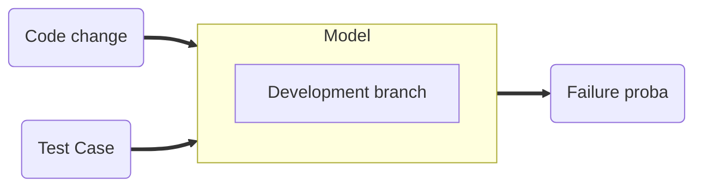

# Overview

    This project is based off this [paper](https://arxiv.org/abs/1810.05286)
    The main idea is to get faster feedback when pushing changes to a feature branch by only running a small subset of
    the test suite. To find which tests to run we use a predictive model that takes 3 inputs:

    ## A code change

    This is the set of files that were modified in this pull request

    ## A test case

    This is the fully qualified name of the test case we are evaluating

    ## The development branch

    The different development branches (iso4, iso5...) have different code bases and different tests

# Parameters

    CHANGE_LOOK_BACK: List[int] = [3, 14, 56]
    This parameter is used to compute the modification_count field. This field denotes if the code change is part of an
    active area of development. For example, with the value above we would count the number of modifications made to the
    files present in the code change in the past 3, 14 and 56 days.

# Data collector design

    In order to train the Predictive Test Selection algorithm, we need a dataset. This dataset holds historic
    information about past test runs. It can be consulted [here](https://grafana.inmanta.com/d/YsUw7VSVk/test-failure-rates?orgId=1&from=now%2Fy&to=now)

    Generic information about the influx db data point format can be found [here](https://docs.influxdata.com/influxdb/v1.8/write_protocols/line_protocol_tutorial/)

    The data is stored in the following format:
        tag_set:
            - fqn: str -> the test case fully qualified name (used for computing test failure rate)
            - commit_hash: str -> ???
            - dev_branch: str -> the dev branch this code change belongs to
        field_set:
            - failed_as_int: int -> denotes if this test failed for this code change
            - modification_count: List[int] -> counts the historic number of modifications made to the files for each
              interval in CHANGE_LOOK_BACK
            - file_extension: Set[str] -> comma separated list of all extensions present in this code change
            - file_cardinality -> number of files affected by this code change
        timestamp: Use influx_db auto-generated timestamp

    """
    x date text NOT NULL,
      test_fqn text NOT NULL,
    x commit_hash text NOT NULL,
    x n_changes_3 int NOT NULL,
    x n_changes_14 int NOT NULL,
    x n_changes_56 int NOT NULL,
    x file_cardinality int NOT NULL,
    x file_extension text NOT NULL,
      target_cardinality int NOT NULL,
      failure_rate_7 real NOT NULL,
      failure_rate_14 real NOT NULL,
      failure_rate_28 real NOT NULL,
      failure_rate_56 real NOT NULL,
      test_failed int NOT NULL
    """

# Predictor design

    Ultimately, the predictor outputs the list of tests to run for a specific code change.
